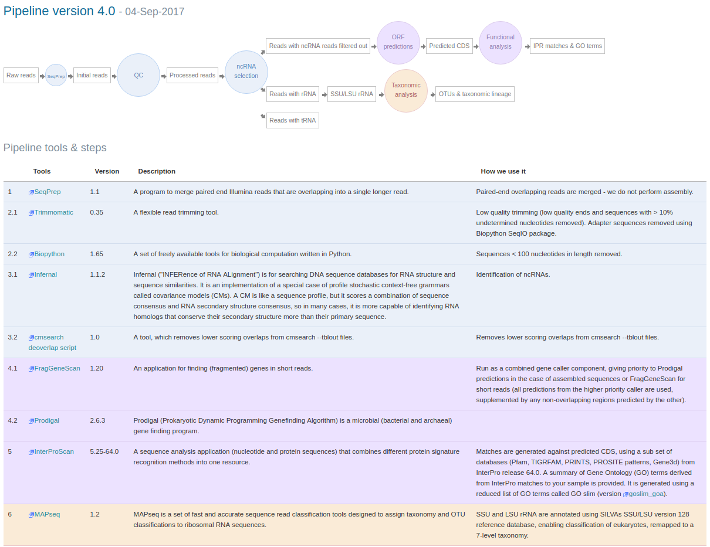
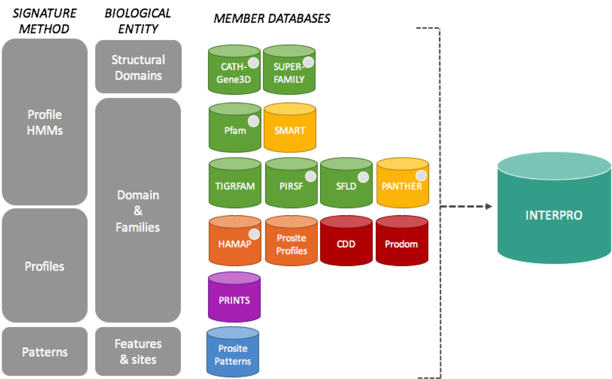
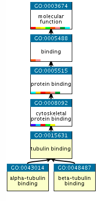

.. _analysis:

Analysis pipeline v4.0
======================

------------------
1 Overview
------------------

Version 4.0 of the pipeline was released in September 2017 and includes the following updates and changes:

* Updated tools: InterProScan to version 5.25-64.0
* rRNASelector (used to identify 16S rRNA genes) was replaced with Infernal for SSU and LSU gene identification
* The QIIME taxonomic classification component was replaced with MAPseq
* The Greengenes reference database was replaced with SILVA SSU / LSU version 128, enabling classification of eukaryotes, remapped to a 8-level taxonomy
* Prodigal was added to run alongside FragGeneScan as part of a combined gene caller when processing assembled sequences

Figure 1 gives a visual overview of the main steps and tools included in this version:

**Figure 1**. Overview of steps and tools included in pipeline v4.0

--------------------
2 Taxonomic analysis
--------------------
The analysis pipeline underwent a substantial update in August 2017 to version 4.0, with the entire taxonomic profiling section replaced. The `rRNASelector <http://europepmc.org/abstract/MED/21887657>`_ based component, which was previously used to identify 16S rRNA genes, was replaced with `Infernal <http://europepmc.org/abstract/MED/24008419>`_ (running in hmm-only mode) using a library of ribosomal RNA hidden Markov models from `Rfam <http://europepmc.org/articles/PMC4383904>`_ 12.2. This allows accurate identification of both large and small subunit (LSU and SSU) ribosomal ribonucleic acid genes, including the eukaryotic 18S rRNA gene. To identify those we use the families found in the following clans: CL00111 (SSU) and CL00112 (LSU).

The QIIME taxonomic classification component was replaced with `MAPSeq <http://www.biorxiv.org/content/early/2017/04/12/126953>`_ version 1.2, which offers fast and accurate classification of reads, and provides corresponding confidence scores for assignment at each taxonomic level. The Greengenes reference database was replaced with `SILVA <http://europepmc.org/articles/PMC3531112>`_ SSU / LSU version 128, which includes eukaryotic as well as prokaryotic sequences, thus enabling eukaryotic taxonomic classification. In order to make it compatible with MAPseq, the SILVA database was remapped to a flat, 8-level taxonomy, using in house scripts. The resulting classification system was compared to QIIME/Greengenes and benchmarked using both mock community and real world datasets to confirm accuracy of results. 

2.1 Other non-coding RNAs
^^^^^^^^^^^^^^^^^^^^^^^^
In addition to the ribosomal subunit RNAs we also identify other non-coding RNAs (ncRNAs) such as SRP RNA, tRNA, tmRNA and RNase. The following clans are used for the ncRNAs: CL00001 (tRNA), CL00002 (RNase P) and CL00003 (SRP RNA).

---------------------
3 Functional analysis
---------------------
Functional analysis of predicted coding sequences (pCDS) from metagenomic data is provided using the `InterProScan <https://www.ebi.ac.uk/interpro/interproscan.html>`_ software provided by the `InterPro <https://www.ebi.ac.uk/interpro/>`_ database. InterPro is a sequence analysis resource that predicts protein family membership, along with the presence of important domains and sites. It does this by combining predictive models known as protein signatures from a number of different databases into a single searchable resource. InterPro curators manually integrate the different signatures, provide names and descriptive abstracts and, whenever possible, add Gene Ontology (GO) terms.

3.1 Protein signatures
^^^^^^^^^^^^^^^^^^^^^^
Protein signatures are obtained by modelling the conservation of amino acids at specific positions within a group of related proteins (i.e., a protein family), or within the domains/sites shared by a group of proteins. InterPro’s different member databases use different computational methods to produce protein signatures, and they each have their own particular focus of interest: structural and/or functional domains, protein families, or protein features, such as active sites or binding sites (see below).

   **InterPro member databases grouped by the methods used to construct their signatures and focus of interest.**

Only a subset of the InterPro member databases are used by EBI Metagenomics: Gene3D, TIGRFAMs, Pfam, PRINTS and PROSITE patterns. These databases were selected since, together, they provide both high coverage and offer detailed functional analysis, and have underlying algorithms that can cope with the vast amounts of fragmentary sequence data found in metagenomic datasets. 

3.2 Assigning GO terms to metagenomic sequences
^^^^^^^^^^^^^^^^^^^^^^^^^^^^^^^^^^^^^^^^^^^^^^^
While InterPro matches to metagenomic sequence sets are informative in their own right, EBI Metagenomics offers an additional type of annotation in the form of Gene Ontology (GO) terms.

The GO is made up of 3 structured controlled vocabularies that describe gene products in terms of their associated biological processes, cellular components and molecular functions in a species-independent manner. By using GO terms, scientists working on different species or using different databases can compare datasets, since they have a precisely defined name and meaning for a particular concept.

   **An example of GO terms organised into a hierarchy.**

Terms in the GO are ordered into hierarchies, with less specific terms towards the top and more specific terms towards the bottom.  (e.g., alpha-tubulin binding is a type of cytoskeletal binding, which is a type of protein binding). Note that a GO term can have more than one parent term. The Gene Ontology also allows for different types of relationships between terms (such as ‘has part of’ or ‘regulates’). The EMG analysis pipeline only uses the straightforward ‘is a’ relationships. More information about the GO can be found on the GO consortium `documentation page <http://www.geneontology.org/page/documentation>`_.

As part of the metagenomic analysis pipeline, GO terms for molecular function, biological process and cellular component are assigned to pCDS in a sample by via the InterPro2GO mapping service. This works as follows: InterPro entries are given GO terms by curators if the terms can be accurately applied to all of the proteins matching that entry. Sequences searched against InterPro are then associated with GO terms by virtue of the entries they match - a protein that matches one InterPro entry with the GO term ‘kinase activity’ and another InterPro entry with the GO term ‘zinc ion binding’ will be annotated with both GO terms.
