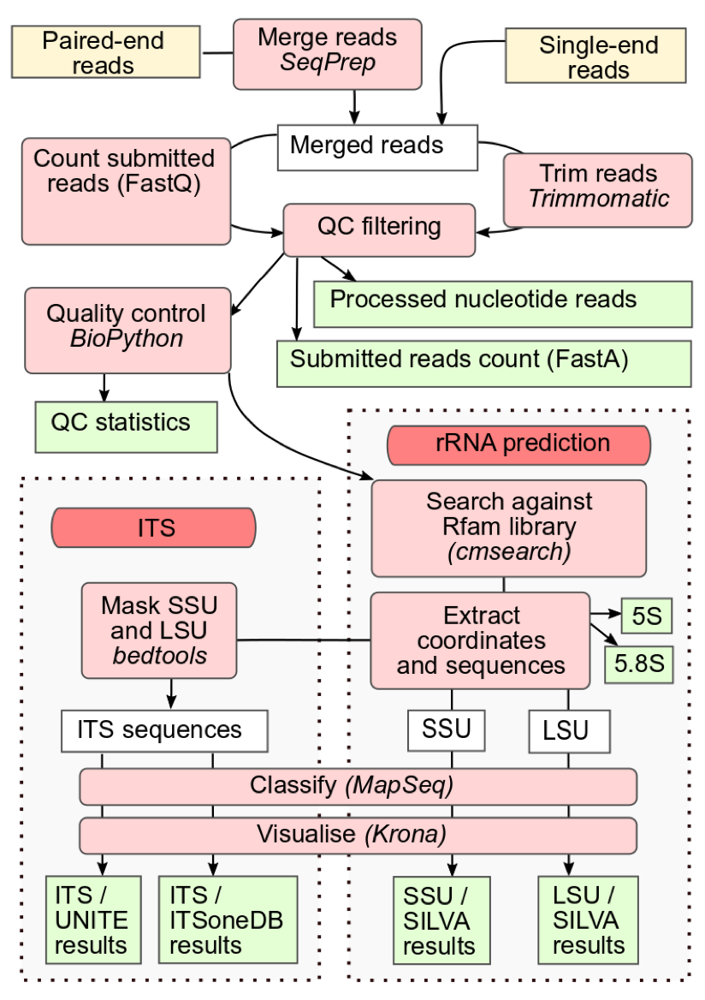

.. _analysis:

Analysis pipeline v5.0
======================

--------
Overview
--------

The latest MGnify analysis service (version 5.0) offers specialised workflows for three different data types: amplicon, raw metagenomic/metatranscriptomic reads, and assemblies. Each workflow is defined in common workflow language (`CWL <https://figshare.com/articles/Common_Workflow_Language_draft_3/3115156/2>`_). (`MGnify v5.0 CWL repository <https://github.com/EBI-Metagenomics/pipeline-v5>`_)

The following processing steps and analyses are performed:

* Merging of paired ends for raw read and amplicon data sets (where applicable)
* Assembly of raw reads (available on request)
* QC of sequences
* rRNA identification and taxonomic assignment of large and small subunit (:term:`LSU and SSU<LSU, SSU>`) ribosomal ribonucleic acid genes (raw reads, assemblies and appropriate amplicon data sets)
* Identification of other ncRNAs (raw reads and assemblies)
* Internal transcribed spacer (ITS) identification and taxonomic assignment of ITS1 and ITS2 regions (appropriate amplicon data sets only)
* mOTUs2 marker gene based taxonomy predictions (raw reads only)
* DIAMOND and UniRef90 protein taxonomy predictions (assemblies only)
* Protein coding sequence prediction with FragGeneScan (raw reads) and a combined  Prodigal & FragGeneScan gene-caller (assemblies)
* InterPro annotations (raw reads and assemblies)
* Gene Ontology (GO) term annotations (raw reads and assemblies)
* KEGG ortholog annotations  (raw reads and assemblies)
* Pfam annotations  (raw reads and assemblies)
* KEGG pathway annotations (assemblies only)
* Genome Properties annotations  (assemblies only)
* antiSMASH annotation of biosynthetic gene clusters  (assemblies only)
* eggNOG functional annotations (assemblies only).

.. list-table:: Software, Databases and Versions used by MGnify
  :widths: 15, 10, 20
  :stub-columns: 2

  * - **Tool/Database**
    - **Version**
    - **Purpose**
  * - SeqPrep
    - *v1.2*
    - Paired end merging
  * - Trimmomatic
    - *v0.36*
    - Quality control
  * - Biopython
    - *v1.74*
    - Quality control
  * - bedtools
    - *v2.28.0*
    - Sequence extraction
  * - Easel
    - *v0.45h*
    - Sequence extraction
  * - Infernal
    - *v1.1.2*
    - RNA prediction
  * - Rfam
    - *v13.0*
    - RNA prediction
  * - MAPseq
    - *v1.2.3*
    - RNA prediction and ITS taxonomic analysis
  * - Kronatools
    - *v2.7.1*
    - Visualisation of taxonomic analyses
  * - biom-format
    - *v2.1.6*
    - Formatting of taxonomic analyses
  * - mOTUs2
    - *v2.5.1*
    - Phylogenetic marker gene profiling
  * - FragGeneScan
    - *v1.20*
    - Coding sequence prediction
  * - Prodigal
    - *v2.6.3*
    - Coding sequence prediction
  * - InterProScan
    - *v75.0*
    - Protein function annotation
  * - eggNOG
    - *v4.5.1*
    - Protein function annotation
  * - eggNOG-mapper
    - *v1.0.3*
    - Protein function annotation
  * - HMMER
    - *v3.2.1*
    - KEGG Ortholog prediction
  * - KOfam - a modified version
    - *2019-04-06 (based on KEGG 90.0)*
    - KEGG Ortholog prediction
  * - KEGG and in-house scripts
    - *90.0*
    - KEGG module prediction
  * - Genome Properties
    - *v2.0.1*
    - Systems and pathways annotation
  * - antiSMASH
    - *v.4.2.0*
    - Secondary metabolite biosynthetic gene cluster annotation
  * - SILVA
    - *release 132*
    - SSU/LSU rRNA taxonomy
  * - ITSoneDB
    - *v1.138*
    - ITS taxonomy
  * - UNITE
    - *v8.0*
    - ITS taxonomy
  * - DIAMOND
    - *v0.9.25.126*
    - Protein sequence-based taxonomic analysis
  * - UniRef90
    - *v2019_11*
    - Protein sequence-based taxonomic analysis

All databases are available from an `FTP link <ftp://ftp.ebi.ac.uk/pub/databases/metagenomics/pipeline-5.0/ref-dbs>`_

---------------------------
Amplicon analysis pipeline
---------------------------

Amplicon reads are merged with SeqPrep (where appropriate) and filtered with Trimmomatic to trim sequence regions with an average Phred 33 quality score less than 15 in a sliding window of 4 base pairs. This is followed by removal of reads less than 100bp in length. An additional Biopython filtering step removes reads with more than 10% ambiguous bases.
`Infernal <http://europepmc.org/abstract/MED/24008419>`_ (running in hmm-only mode) using a library of ribosomal RNA hidden Markov models from `Rfam <http://europepmc.org/articles/PMC4383904>`_ is run to identify LSU and SSU sequences, using families found in the following clans: CL00111 (SSU) and CL00112 (LSU). Theses are undergo taxonomic classification using the `SILVA <https://academic.oup.com/nar/article/41/D1/D590/1069277>`_ database in conjunction with `MAPSeq <https://academic.oup.com/bioinformatics/article/33/23/3808/4082276>`_  which offers fast and accurate classification of reads, and provides corresponding confidence scores for assignment at each taxonomic level.

MGnify can also provide analysis of ITS amplicons. ITS1 and ITS2 reside between the LSU and SSU genes and can be targeted for accurate classification of eukaryotic organisms. ITS taxonomy is assigned by MAPseq using two reference databases: `ITSoneDB <https://academic.oup.com/nar/article/46/D1/D127/4210943>`_  containing ITS1 sequences and `UNITE <https://academic.oup.com/nar/article/47/D1/D259/5146189>`_ containing ITS1 and ITS2 sequences. The SSU and LSU regions are masked using Rfam, as described above, prior to ITS classification, minimising cross reactivity.

**Figure 1**. Overview of the main steps in the amplicon workflow.

----------------------------
Raw reads analysis pipeline
----------------------------

Metagenomic and metatranscriptomic raw reads undergo merging, quality control and SSU/LSU based taxonomic analysis, as described for the amplicon pipeline above.
Additional non-coding RNAs (ncRNAs) are identified with Infernal, using families from the following Rfam clans: CL00001 (tRNA), CL00002 (RNAse) and CL00003 (SRP).
Supplementary phylogenetic classification based on marker gene profiling, is performed using `mOTUs2 <https://www.nature.com/articles/s41467-019-08844-4>`_ on the quality controlled reads.

For functional analysis, the sequence regions encoding rRNAs are masked, and `FragGeneScan <https://academic.oup.com/nar/article/38/20/e191/1317565>`_ is used to predict coding sequences (pCDS). Coding sequences are assigned protein annotations with InterProScan, using 5 member databases that are able to process large numbers of potentially fragmented sequences (Gene3D, TIGRFAMs, Pfam, PRINTS and PROSITE patterns). Pfam annotations are provided as separate visualisations and downloads. GO terms are extracted from the InterProScan results and grouped according to category (Biological Process, Molecular Function and Cellular Component). GO terms are also summarized using a specialized `GO Slim <http://www.geneontology.org/ontology/subsets/goslim_metagenomics.obo>`_ developed for metagenomic data. Finally, protein coding sequences undergo KEGG ortholog annotations using HMMER v3.2.1 and a modified version of KOfam 2019-04-06 (based on KEGG 90.0).

.. figure:: images/pipeline_v5.0_raw.png
  :scale: 50 %

**Figure 2**. Overview of the main steps in the raw reads workflow.

---------------------------
Assembly analysis pipeline
---------------------------

Users can request assembly of their own raw sequencing reads, or publicly available datasets, using the ‘Request analysis’ section of the `MGnify home page <https://www.ebi.ac.uk/metagenomics/>`_ Users own raw reads (with host sequences removed) must be archived in ENA before submitting an assembly request. The sequences then undergo quality control, as well as a precautionary additional host contamination removal process (where applicable) with bwa-mem. `metaSPAdes <https://www.ncbi.nlm.nih.gov/pmc/articles/PMC5411777/>`_ is used for assembly of paired end reads and `SPAdes <https://www.ncbi.nlm.nih.gov/pmc/articles/PMC3342519/>`_ for single reads. Alternatively, pre-assembled datasets, including those produced using other assembly algorithms, can be analysed. Quality control for assemblies is based on sequence length, with contigs less than 500 nucleotides removed from the analysis process.

rRNAs are identified and undergo taxonomic analysis as for raw reads above. Sequence regions encoding rRNAs are masked and protein coding sequences are predicted using a combined gene caller that utilises both `Prodigal <https://bmcbioinformatics.biomedcentral.com/articles/10.1186/1471-2105-11-119>`_ and FragGeneScan. In addition to rRNA-based taxonomic analyses, `DIAMOND <https://www.nature.com/articles/nmeth.3176>`_ is used to assign taxonomy to protein sequences, based on the top hit to the `UniRef90 <https://academic.oup.com/bioinformatics/article/31./6/926/214968>`_ database.

Protein function is assigned in the form of InterProScan annotations, GO terms, and KEGG ortholog predictions, as described for the raw reads analysis pipeline above.
Additionally, clusters of orthologous groups (COGs) annotations and eggNOG functional descriptions are provided by the `eggNOG-mapper tool <https://www.biorxiv.org/content/10.1101/076331v1.full>`_

KEGG ortholog annotations are further processed to produce KEGG pathway information, including module presence and completeness. Similarly, InterPro annotations for individual protein sequences are amalgamated to generate `Genome Properties <https://academic.oup.com/nar/article/47/D1/D564/5144958>`_ (GP), providing inference of higher level pathways and systems that may be present in the dataset. Finally, antiSMASH (REF) is used to identify and annotate biosynthetic gene clusters that code for the production of secondary metabolites.

.. figure:: images/pipeline_v5.0_assembly.png
   :scale: 50 %

**Figure 3**. Overview of the main steps in the assembly workflow.
