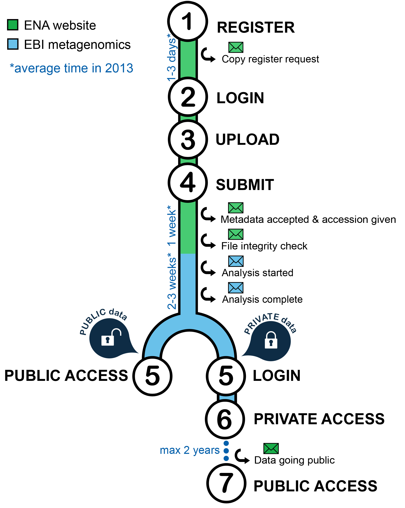

--------------------------
EBI Metagenomics data flow
--------------------------

The graph below summarize the EBI Metagenomics data flow from submission to analysis results:

(1) Submissions are handled by the `European Nucleotide Archive (ENA) <http://www.ebi.ac.uk/ena/>`_ and users have to have an ENA `Webin account <https://www.ebi.ac.uk/ena/submit/sra/#registration>`_.

(2) Access to the `ENA submission page <https://www.ebi.ac.uk/ena/submit/sra/#home>`_ requires login in using a registered email address or a Webin identifier (Webin-XXXX).

(3) and (4): these steps are described in details in the `ENA tutorials <https://github.com/ProteinsWebTeam/EMG-docs/blob/master/docs/tutorials.rst>`_. EBI Metagenomics is also providing a step by step guide accessible on the same page.
Note that all queries concerning data submission should be directed to `_ENA dedicated help desk <mailto:datasubs@ebi.ac.uk>_

