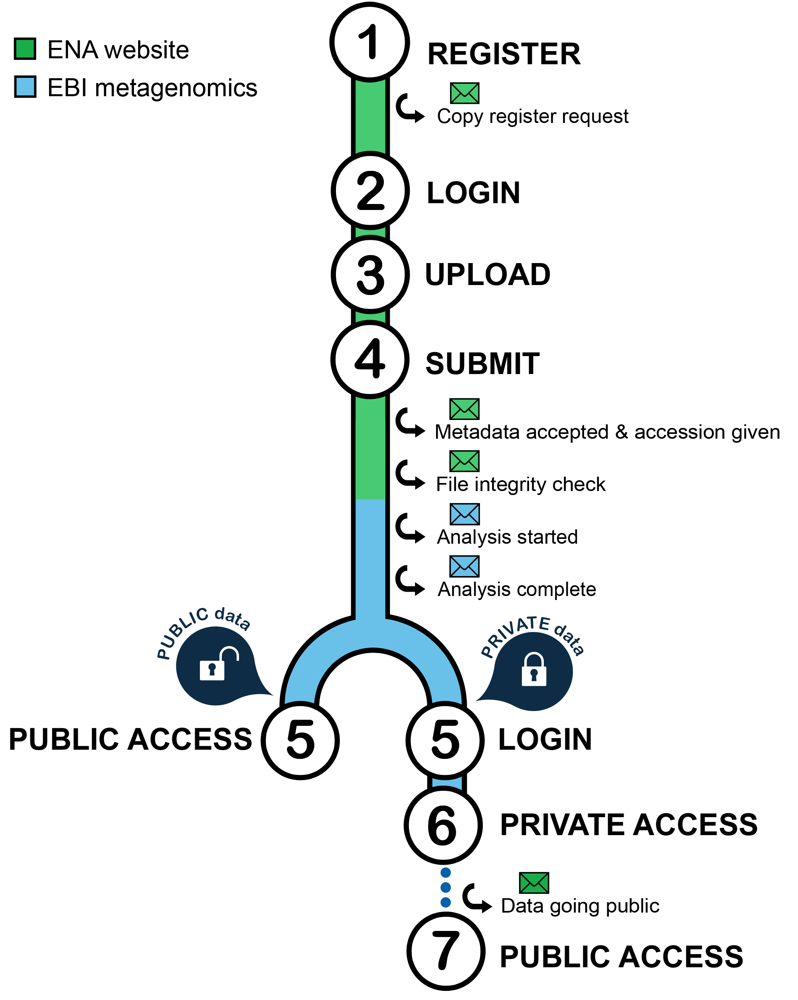

------------------------------------
Data flow from submission to results
------------------------------------

The graph below summarize the MGnify data flow from submission to :term:`analysis results<analysis result>`:

.. https://stackoverflow.com/questions/12297493/why-does-image-scale-not-work-in-restructuredtext-when-generating-html-files

**(1) Submissions are handled by the** `European Nucleotide Archive (ENA) <https://www.ebi.ac.uk/ena/>`_ **and therefore users have to have an ENA** `Webin account <https://www.ebi.ac.uk/ena/submit/sra/>`_.

  In addition, users submitting private data have to provide an expressed agreement that MGnify can access their data for analysis, as described under `Submit data <https://www.ebi.ac.uk/metagenomics/submit>`_. Otherwise, we will not be able to access their data. MGnify will, of course, handle this data confidentially.

**(2) Access to the** `ENA submission page <https://www.ebi.ac.uk/ena/submit/sra/>`_ **requires login in using a registered email address or a Webin identifier (Webin-XXXX).**

**(3 and 4): upload and submission.**

  These steps are described in detail in the :ref:`ENA online guides`. The :ref:`MGnify and EMBL-EBI online tutorials` provide a step by step guide to submission. Please also check our :ref:`FAQs <faq>`.

  *Note that all queries concerning data submission should be directed to* `ENA dedicated help desk <https://www.ebi.ac.uk/ena/browser/support>`_

  After validation by ENA, we will be able to access the submitted data and they will be queued for analysis (more details about our :ref:`Analysis pipeline <analysis>`).

  The length of time required for analysis varies according to the number of projects in the queue and the nature and the number of runs in the submission. However we aim to have most analysis completed in less than a week once validated by ENA.

**(5) Upon completion of analysis, data will be uploaded on the website**

  MGnify pipeline will generate a number of charts and downloadable files (:ref:`Files available to download on the MGnify website`).

**(6) For private data, users will have to login on the MGnify website to access their data until they become public**

**(7) Private data will become public after an initial confidential period of two years.**
Submitters will receive an email from ENA prior to public release giving them the opportunity to extend the confidential period which is set to two years per default (as indicated at :ref:`Can I change the release date of my project?`).
