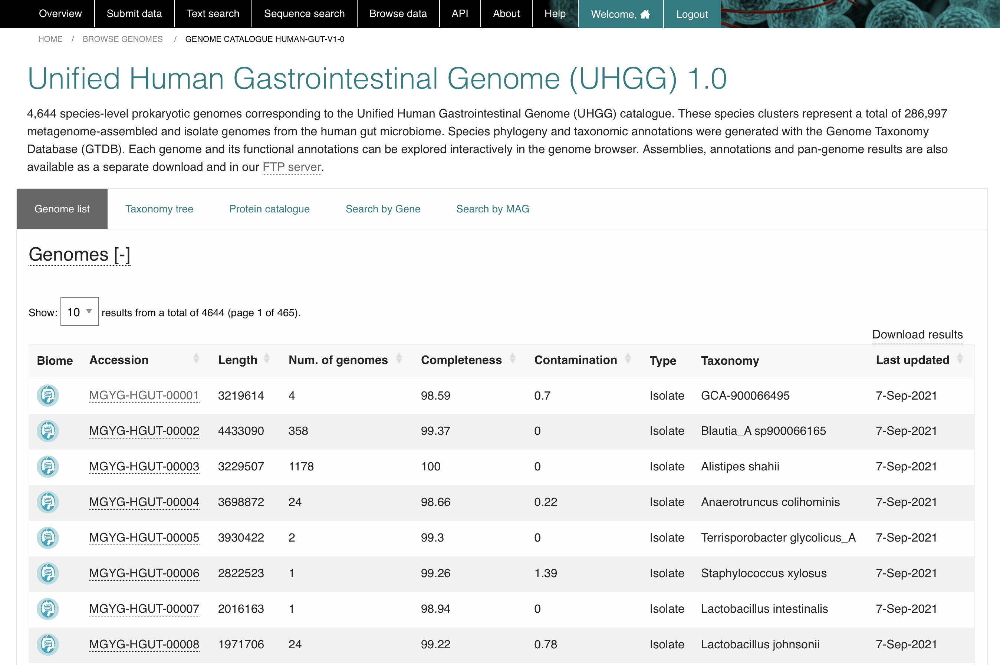
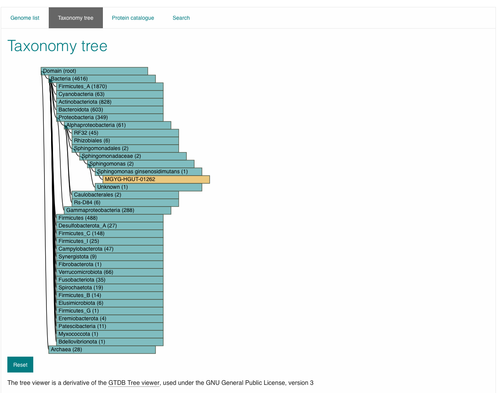
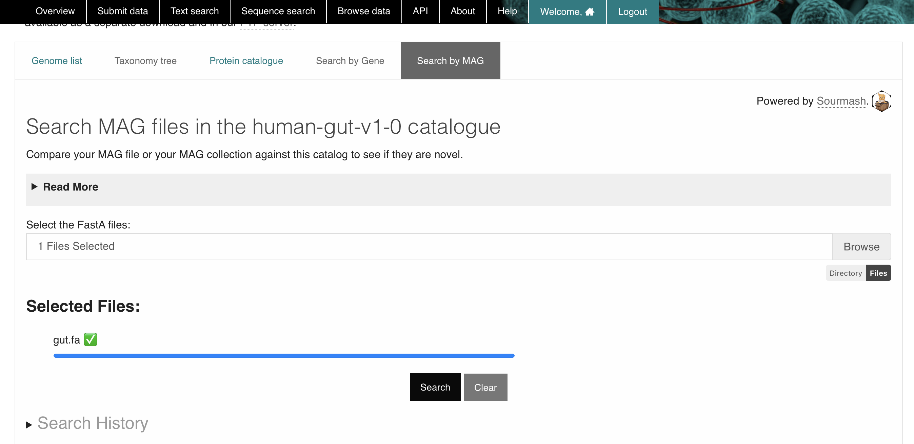
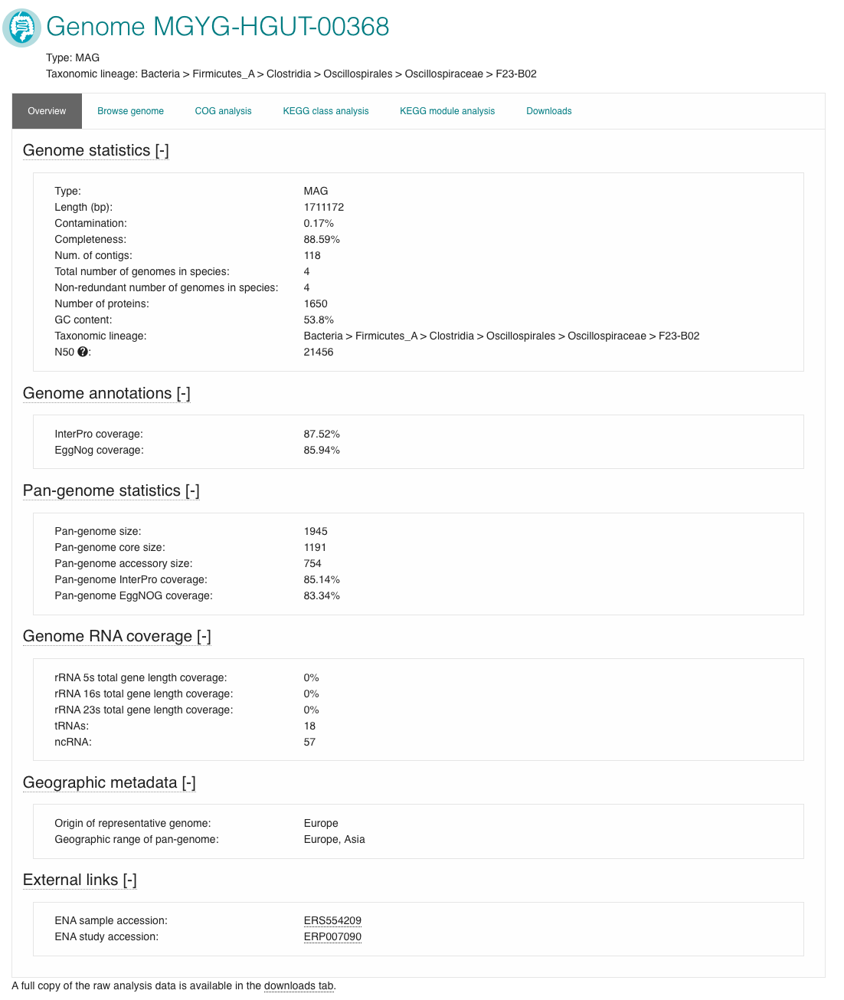

.. _genome-viewer:

MGnify Genomes
^^^^^^^^^^^^^^^
-----------------
Genome Catalogues
-----------------

MGnify Genomes (accessed from the 'Genomes' tab of the 'Browse' area in the menu bar)
provides a detailed interactive view of prokaryotic genomes and their functional annotations.

MGnify displays genomes in biome-specific Catalogues.

The latest version of each Catalogue is shown on the website,
whilst older versions can be downloaded from our `FTP server <http://ftp.ebi.ac.uk/pub/databases/metagenomics/mgnify_genomes/>`_.

.. figure:: images/genomes-genome-catalogues-list-v1.png
  :width: 100%

**Figure 1**. MGnify genomes are collected into biome-specific catalogues.

--------------------
Browsing a catalogue
--------------------
Clicking on a Catalogue ID in the list allows you to browse the catalogue's contents.

The "Genome list" tab contains a catalogue of non-redundant isolate and metagenome assembled genomes (:term:`MAGs`).
Each accession is a species representative of a cluster of genomes.
To constitute a cluster: genomes with completeness greater than 50%, contamination less than 5% and average quality score (completeness - 5*contamination) greater than 50 - calculated with `CheckM, v.1.0.11 <https://genome.cshlp.org/content/25/7/1043?ijkey=a446ec2b6e540d598d39c9253e0fdfbdab52b2f4&keytype2=tf_ipsecsha>`_ are clustered with `dRep v2.2.4 <https://www.nature.com/articles/ismej2017126>`_ using an average nucleotide identity (ANI) cutoff of  ≥95% and an aligned fraction (AF) of ≥30% .
The species representative for each cluster is the best quality genome judged by completeness, contamination and the assembly N50 values.
Isolate genomes are prioritised over MAGs for a species representative.

**Figure 2**. Each catalogue contains MAGs and isolate genomes.

The ‘Taxonomy tree’ is a subset of the GTDB taxonomy which can be viewed interactively.
Genomes from the catalogue can be found in the tree by taxonomic lineage.
Each orange coloured genome accession links to further statistics and functional annotation data.

**Figure 3**. GTDB interactive taxonomy tree for a catalogue

The ‘Protein catalogue’ is clusters of all the predicted coding sequences in the genome catalogue.
Separate catalogues are generated at different amino acid identity levels (100%, 95%, 90% and 50%).
Data for the Protein catalogue are available at the linked FTP server location.

Searching a catalogue
---------------------

The ‘Search by gene’ tab is a `BItsliced Genomic Signature Index (BIGSI)  <https://www.nature.com/articles/s41587-018-0010-1>`_ based search engine.
BIGSI queries short sequence fragments against the species representative genome catalogue.
The table of results provides the user with direct links to the matching genomes.
Match statistics are shown as a count and percentage of kmers found.
The minimum kmer proportion is set at a default of 0.4 and can be increased or decreased within a range of 0.1-1 with the available toggle.

.. figure:: images/genomes-bigsi-v6.png
  :width: 100 %

**Figure 4** BIGSI search example with table of results.

The ‘Search by MAG’ tab is a `Sourmash <https://sourmash.readthedocs.io/en/latest/>`_ based search engine.
Sourmash queries complete MAGs for similarity against the species representative genome catalogue.

Use the browse button to upload either a single FastA file, or multiple files by holding [ctrl] or [shift] while clicking in the file explorer.
Alternatively you can select a whole directory of files using the directory mode (select this option below the Browse button).
In this mode, the tool will process all FastA files in the selected directory, however it will not check subdirectories.
Files are not uploaded onto MGnify servers.
Rather, Sourmash generates a signature of your file(s) in your browser, and compares this signature against our MAG catalogue on the server.
Successful searches create a CSV result file for each signature submitted.
These are compiled into a TGZ allowing you to fetch all your results in one click.
These result files are only stored in our servers for 30 days, so please be sure to download them before they expire.

**Figure 5** Sourmash search example with file selected

--------------
Genome detail
--------------

View a specific Genome by clicking it in the Genomes List, or a search result.

The page header details the genome type and a full GTDB lineage assigned with `GTDB-tk <https://academic.oup.com/bioinformatics/advance-article/doi/10.1093/bioinformatics/btz848/5626182>`_. The ‘Overview’ tab contains statistics about the genome. Type of genome (isolate or MAG), length, percentage completeness and contamination, the number of contigs, number of genomes represented by the species cluster, total number of proteins, N50 and GC content are shown here.

`Infernal <http://europepmc.org/abstract/MED/24008419>`_ is used to screen for the presence of ribosomal RNAs against `Rfam <http://europepmc.org/articles/PMC4383904>`_ covariance models for 5S, 16S and 23S rRNA. Transfer RNAs are identified with `tRNAScan-SE <https://academic.oup.com/nar/article/25/5/955/5133591>`_. These figures are presented in the Genome RNA
coverage section, as the percentage coverage for each rRNA type and a count of total tRNA and ncRNAs.

:term:`pCDS<Predicted coding sequence (pCDS)>` are inferred with `Prokka <https://academic.oup.com/bioinformatics/article/30/14/2068/2390517>`_ which uses `Prodigal <https://bmcbioinformatics.biomedcentral.com/articles/10.1186/1471-2105-11-119>`_ . `eggNOG-mapper tool <https://www.biorxiv.org/content/10.1101/076331v1.full>`_ assigns :term:`KEGG` and :term:`COG` annotations against the pCDS. InterProScan performs protein annotations with 5 member databases. The proportion of predicted proteins with an :term:`InterPro` or eggNOG annotation are given as a coverage percentage. COG and KEGG annotations are visualised in their respective tabs with the top 10 hits in an interactive bar graph.

Additionally, the geographic origin of each genome, and links to ENA accessions can be found towards the bottom of this page.

All genome annotations can be viewed interactively in the ‘Browse genome’ tab to browse all assigned functional annotations in more detail.

------------------
Pan-genome
------------------

Genome accessions with more than 1 genome in a species cluster have additional pan-genome analyses. `Roary v3.12.0 <https://academic.oup.com/bioinformatics/article/31/22/3691/240757>`_ performs an iterative clustering of predicted genes with greater than 90% amino acid identity (AAI) for all genomes in the species cluster, to infer a core genome. Further BLASTp steps identify groups of homologous genes pertaining to the accessory genomes. The overview page has an extra 'Pan-genome statistics' block. Figures for pan-genome size - a ratio of the total core and accessory genes versus the total number of genes in the species representative, pan-genome core size and pan-genome accessory size can be found here. `eggNOG-mapper tool <https://www.biorxiv.org/content/10.1101/076331v1.full>`_  and InterProScan annotations are performed as above. The COG and KEGG visualisations have an extra bar in the plot representing the pan-genome analysis.

The ‘Downloads’ tab comprises summary files for all described analyses.

**Figure 6**. An overview for a species representative MAG, with a pan-genome analysis.

A set of assemblies, annotations, :term:`pan-genome<Pan-genome>` results and protein catalogues are available in our `FTP server <http://ftp.ebi.ac.uk/pub/databases/metagenomics/mgnify_genomes/>`_.
