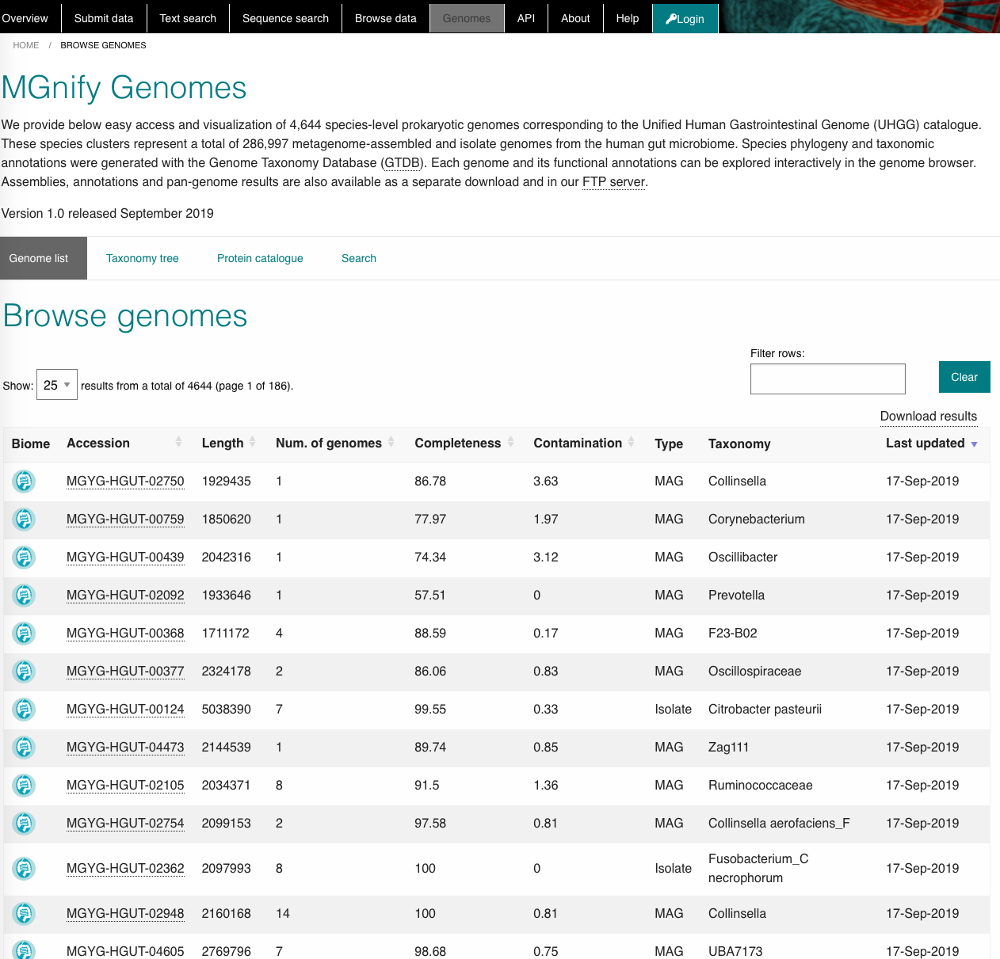
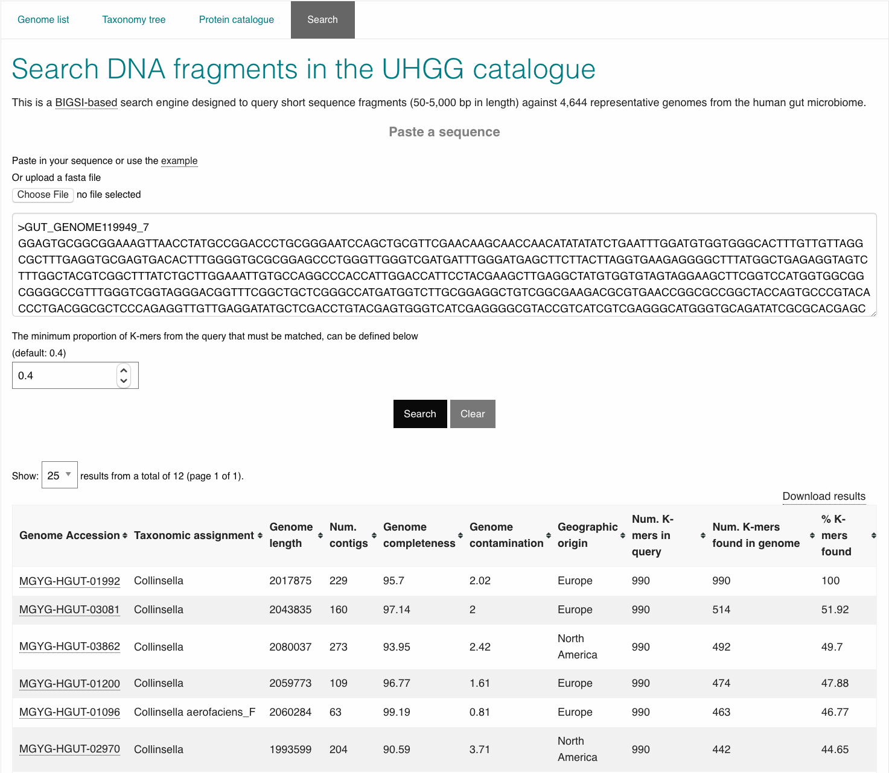
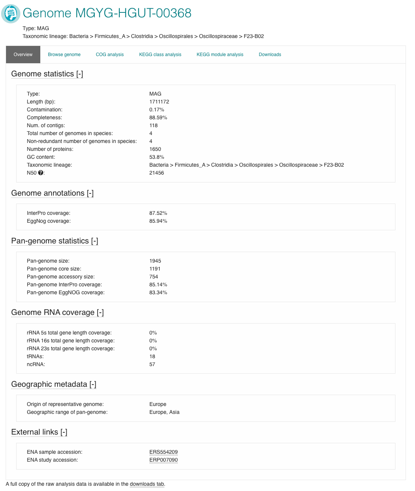

.. _genomes:

MGnify Genomes
^^^^^^^^^^^^^^^
------------------
Landing page
------------------

MGnify Genomes (accessed by following the 'Genomes' link from the menu bar)
provides a detailed interactive view of prokaryotic genomes and their functional annotations.

The ‘Genome list’ tab contains a catalogue of non-redundant isolate and metagenome assembled genomes (:term:`MAGs`). Each accession is a species representative of a cluster of genomes. To constitute a cluster: genomes with completeness greater than 50%, contamination less than 5% and average quality score (completeness - 5*contamination) greater than 50 - calculated with `CheckM, v.1.0.11 <https://genome.cshlp.org/content/25/7/1043?ijkey=a446ec2b6e540d598d39c9253e0fdfbdab52b2f4&keytype2=tf_ipsecsha>`_ are clustered with `dRep v2.2.4<https://www.nature.com/articles/ismej2017126>_` using an average nucleotide identity (ANI) cutoff of  ≥95% and an aligned fraction (AF) of ≥30% . The species representative for each cluster is the best quality genome judged by completeness, contamination and the assembly N50 values. Isolate genomes are prioritised over MAGs for a species representative.

A set of assemblies, annotations and pan-genome results are also available as a separate download and in our
`FTP server <http://ftp.ebi.ac.uk/pub/databases/metagenomics/mgnify_genomes/>`_.

**Figure 1**. The landing page of the MGnify genomes tool is a catalogue of MAGs and isolate genomes.

The ‘Taxonomy tree’ is a subset of the GTDB taxonomy which can be viewed interactively. Genomes from the catalogue can be found in the tree by taxonomic lineage. Each orange coloured genome accession links to further statistics and functional annotation data.

.. figure:: images/genomes_taxonomy_tree.png
  :scale: 50 %

**Figure 2**. GTDB interactive taxonomy tree

The ‘Protein catalogue’ are clusters of all the predicted coding sequences in the genome catalogue. Separate catalogues are generated at different amino acid identity levels (100%, 95%, 90% and 50%) and are available on our `FTP server <ftp://ftp.ebi.ac.uk/pub/databases/metagenomics/mgnify_genomes/>`_

The ‘Search’ tab is a `BItsliced Genomic Signature Index (BIGSI)  <https://www.nature.com/articles/s41587-018-0010-1>`_ based search engine. BIGSI  queries short sequence fragments against the species representative genome catalogue. The table of results provides the user with direct links to the matching genomes. Match statistics are shown as a count and percentage of kmers found. The minimum kmer proportion is set at a default of 0.4 and can be increased or decreased within a range of 0.1-1 with the available toggle.

**Figure 3** BIGSI search example with table of results.

--------------
Genomes
--------------

The page header details the genome type and a full GTDB lineage assigned with `GTDB-tk <https://academic.oup.com/bioinformatics/advance-article/doi/10.1093/bioinformatics/btz848/5626182>`_. The ‘Overview’ tab contains statistics about the genome. Type of genome (isolate or MAG), length, percentage completeness and contamination, the number of contigs, number of genomes represented by the species cluster, total number of proteins, N50 and GC content are shown here.

`Infernal <http://europepmc.org/abstract/MED/24008419>`_ is used to screen for presence of ribosomal RNAs against `Rfam <http://europepmc.org/articles/PMC4383904>`_ covariance models for 5S, 16S and 23S rRNA. Transfer RNAs are identified with `tRNAScan-SE <https://academic.oup.com/nar/article/25/5/955/5133591>`_. These figures are presented in the Genome RNA
coverage section, as the percentage coverage for each rRNA type and a count of total tRNA and ncRNAs.

:term:`pCDS` are inferred with `Prokka <https://academic.oup.com/bioinformatics/article/30/14/2068/2390517>`_ which uses `Prodigal <https://bmcbioinformatics.biomedcentral.com/articles/10.1186/1471-2105-11-119>`_ . `eggNOG-mapper tool <https://www.biorxiv.org/content/10.1101/076331v1.full>`_ assigns KEGG and COG annotations against the pCDS. InterProScan performs proteins annotations with 5 member databases as described in (link to analysis pipeline page). The proportion of predicted proteins with an InterPro or eggNOG annotation are given as a coverage percentage. COG and KEGG annotations are visualised in their respective tabs with the top 10 hits in an interactive bar graph.

Additionally, the geographic origin of each genome and links to ENA accessions can be found towards the bottom of this page.

All genome annotations can be viewed interactively in the ‘Browse genome’ tab to browse all assigned functional annotations in more detail.

------------------
Pan-genome
------------------

Genome accessions with more than 1 genome in a species cluster have additional pan-genome analyses. `Roary v3.12.0 <https://academic.oup.com/bioinformatics/article/31/22/3691/240757>`_ performs an iterative clustering of predicted genes with a greater than 90% amino acid identitiy (AAI) for all genomes in the species cluster, to infer a core genome. Further BLASTp steps identify groups of homologous genes pertaining to the accessory genomes. The overview page has an extra 'Pan-genome statistics' block. Figures for pan-genome size - a ratio of the total core and accessory genes versus the total number of genes in the species representative, pan-genome core size and pan-genome accessory size can be found here. `eggNOG-mapper tool <https://www.biorxiv.org/content/10.1101/076331v1.full>`_  and InterProScan annotations are performed as above. The COG and KEGG visualisations have an extra bar in the plot representing the pan-genome analysis.

The ‘Downloads’ tab comprises summary files for all described analysis.

**Figure 4**. An overview for a species representative MAG, with a pan-genome analysis.
