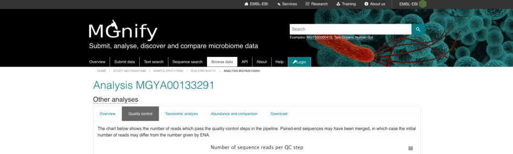
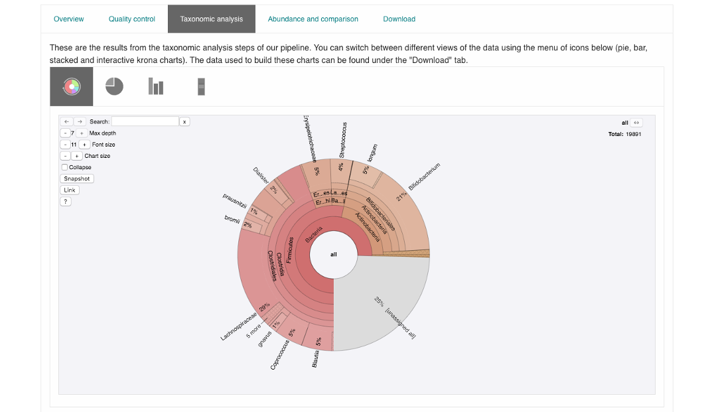

Website and portal
==================
------------------------------------------------------
Content of the 'Associated runs' table on project page
------------------------------------------------------

This table lists all :term:`samples<sample>` and :term:`runs<run>` associated with a project as well as the experiment type (:term:`Amplicon<amplicon>`, :term:`Assembly<assembly>`, :term:`Metabarcoding<metabarcoding>`, :term:`Metagenomic<metagenomic>` or :term:`Metatranscriptomic<metatranscriptomic>`), sequencing instrument model and pipeline version for each individual run.
In addition, the last field displays links to analysis results and download pages (the latter being represented by the |icon| icon).

.. |icon| image:: images/download_IC.png

------------------------------------------------------------------------------
Finding quality control information about runs on the MGnify website
------------------------------------------------------------------------------

Quality control (QC) analysis of runs within projects on the `MGnify website <https://www.ebi.ac.uk/metagenomics/>`__ can be accessed by selecting the 'Quality control' tab found toward the top of any run page (see Figure 1 below).

**Figure 1**. A 'Quality control' tab can be found towards the top of each run page.

Selecting this tab brings up a page containing four graphical representations: a count of reads/contigs remaining pre and post QC, a histogram of minimum, maximum and average sequence length (post QC), distribution of GC content and the first 500 nucleotides (post QC). These are available to download via the 'Download' tab found toward the top of any run page (see Figure 8 below).

**Figure 2**. Typical even nucleotide distribution expected for metagenome, metatranscriptome and assembly datasets. Note that the stretch of uneven distribution observed until position 20 are indicative that the sequencing adapters had not been completely removed in the submitted reads.

.. image:: images/QC_ndamplicon.PNG

**Figure 3**. Typical uneven nucleotide distribution expected for an amplicon dataset.

-------------------------------------------------------------------------
Finding functional information about runs on the MGnify website
-------------------------------------------------------------------------

Functional analysis of runs within projects on the `MGnify website <https://www.ebi.ac.uk/metagenomics/>`__ can be accessed by selecting the 'Functional Analysis' tab found toward the top of any run page (see Figure 4 below). Note that this tab will be greyed for amplicon runs that have no functional results.

.. image:: images/Func_1.PNG (this image needs changing! Once bar graphs are changed! - The below paragraph also applies)

**Figure 4**. A Functional analysis tab can be found towards the top of each run page. Selecting this tab brings up a page displaying sequence features ('Predicted CDS', 'Contigs with predicted CDS' and 'Contigs with predicted rRNA')

Below this first bar chart, there are 4 tabs with different types of functional annotation:

**A**

.. image:: images/Func1-v5.png

**B**

.. image:: images/Func2-v5.png

**C**

**D**

.. image:: images/Func4-v5.png

**Figure 5**. Functional analysis of metagenomics data, as shown on the MGnify website.
A) InterPro match information for the predicted coding sequences in the run is shown. The number of InterPro matches are displayed graphically, and as a downloadable table with links to corresponding InterPro entries. B) Predicted GO slim terms are displayed. Different graphical representations are available, and can be selected by clicking on the ‘Switch view’ icons. C) A table of Pfam matches for predicted coding sequences with a bar graph showing the top 10 hits. D) A table of KEGG ortholog matches for predicted coding sequences with a bar graph showing the top 10 hits.

-------------------------------------------------------------------------
Finding pathways/systems information about runs on the MGnify website
-------------------------------------------------------------------------

Pathway and systems annotation of runs within projects on the `MGnify website <https://www.ebi.ac.uk/metagenomics/>`__ can be accessed by selecting the 'Pathways/Systems' tab found toward the top of any run page. Note that this tab will only be accessible for assembly analysis.

There are 3 types of pathways and systems annotations:

**A**

**B**

**C**

.. image:: images/Path3-v5.png

**Figure 6**. Annotation of potential pathways and high order system classification, as shown on the MGnify website. A) A table and bar graph of KEGG modules derived from KEGG orthologs, with pathway completeness values. B) An expandable list of present Genome Properties, grouped by top level systems, derived from InterProScan outputs. C) A table of antiSMASH hits with a bar graph showing the top 10 hits.

------------------------------------------------------------------------
Viewing functional annotation per contig
------------------------------------------------------------------------

This feature is available for assembly analysis only and can be found in the tab 'Contig Viewer'.

**A**

**B**

.. image:: images/Contig2-v5.png

**Figure 8**. Interactive contig viewer for localised visualisation of functional annotation per contig. A) The main page contains a table of contigs with annotations, length and coverage. Text search and tickboxes allow users to search for functional annotations by method. B) Hover over each coding sequence to see functional annotation with external links, and protein length for that region.

------------------------------------------------------------------------
Finding taxonomic information about runs on the MGnify website
------------------------------------------------------------------------

Taxonomic analysis of runs within projects on the `MGnify website <https://www.ebi.ac.uk/metagenomics/>`__ can be accessed by selecting the 'Taxonomic analysis' tab found toward the top of any run page (see Figure 7 below).

**Figure 7**. A 'Taxonomic analysis' tab can be found towards the top of each run page. Selecting this tab brings up a page displaying the taxonomic results displayed as an interactive Krona plot.

The taxonomic analysis results are displayed as Krona plot. This feature allows users to explore their taxonomic results and to zoom in on a particular taxonomic level by double clicking on it. The corresponding distribution charts are displayed on the right hand side of the panel.

Alternative pie, bar and stacked chart representations can be generated by clicking on the ‘Switch view’ icons located above the Krona plot however data are then presented at the phylum level for clarity.

-----------------------------------------------------------
Files available to download on the MGnify website
-----------------------------------------------------------

The full data sets used to generate the graphs, along with a host of additional data and intermediate files can be downloaded for further analysis by clicking the ‘Download’ tab, found towards the top of the page.

**Figure 8**. The Download tab is organised in 3 sections: ‘Sequence data’, ‘Functional analysis’ (not available in the case of amplicon runs), 'Pathways and Systems' (available only for assemblies), ‘Taxonomic analysis SSU’, 'Taxonomic analysis LSU', 'Taxonomic analysis ITS' (available for amplicon only) and 'non-coding RNAs' (will only exist if any non coding RNAs are identified).

Some of the files, particularly the sequence files in FASTA format, can be large. To facilitate their download process, these files are compressed with `GZIP <https://en.wikipedia.org/wiki/Gzip>`_ and when too large to be easily transferable, chunked in manageable size. If it is the case for your runs, please download all chunks, decompress them and concatenate them to reconstitute the full file. Ensure the chunks are concatenated in the order given on the download page, as headers will be in the first chunked file.

Description of fasta files available to download
^^^^^^^^^^^^^^^^^^^^^^^^^^^^^^^^^^^^^^^^^^^^^^^^
- Processed nucleotide reads OR Processed contigs: this file contains all reads/contigs having passed the quality control (QC) step.
- Predicted CDS: this file contains protein sequences having pCDS.
- Predicted ORF: this file contains nucleotide sequences having pCDS.

Description of functional annotation files available to download
^^^^^^^^^^^^^^^^^^^^^^^^^^^^^^^^^^^^^^^^^^^^^^^^^^^^^^^^^^^^^^^^
- InterPro matches: A tab-delimited file containing 15 columns. They are fully described `here <https://github.com/ebi-pf-team/interproscan/wiki/OutputFormats>`_
- Pfam annotation: summary of Pfam annotations and their frequencies.
- Complete GO annotation: summary of GO term annotations in 4 columns: GO terms (labelled GO:XXXXXXX), GO term description, GO category (biological process, molecular function or molecular function) and number of pCDS annotated with a GO term.
- GO slim annotation file: this file is derived from the 'Complete GO annotation file' and has the same format.
- DIAMOND annotation: a tab-delimited file containing 16 columns with Uniref IDs and taxonomic annotation of protein sequences.
- KEGG orthologues annotation: summary of KEGG ortholog annotations and their frequencies.

Description of pathways and systems annotation files available to download
^^^^^^^^^^^^^^^^^^^^^^^^^^^^^^^^^^^^^^^^^^^^^^^^^^^^^^^^^^^^^^^^^^^^^^^^^^
- antiSMASH annotation: EMBL flatfile and GenBank formatted filed with annotations per contig.
- Genome Properties annotation: summary of genome properties and and their frequency.
- KEGG pathway annotation: summary of KEGG modules, pathway names and completeness.

Description of taxonomic assignment files available to download
^^^^^^^^^^^^^^^^^^^^^^^^^^^^^^^^^^^^^^^^^^^^^^^^^^^^^^^^^^^^^^^^
- Reads/Contigs encoding...: All reads predicted to encode for LSU, SSU, ITS or any other non-coding RNAs (ncRNAs). LSU, SSU and ncRNAS are predicted with Infernal. ITS have the predicted LSU and SSU sequences masked.
- MAPseq assignments: this file contains the output from mapseq - a taxonomic assignment where applicable for each input sequence.
- OTUs, counts and taxonomic assignments (TSV): this file contains a taxonomic lineage column followed by the frequency of it's annotation and the corresponding NCBI taxid (not available for UNITE).  This file can be directly imported into `Megan6 <http://ab.inf.uni-tuebingen.de/software/megan6/>`_ for visualisation and further analysis.
- OTUs, counts and taxonomic assignments (HDF5/JSON) - two files for each type of rRNA or ITS database. These contain the same taxonomic information as the TSV files in JSON and HDF5 formats. The Biom files are `computer-readable files <http://biom-format.org>`_. The HDF5 (Hierarchical Data Format) format can be imported into analysis and visualisation tools such as Matlab and R. A larger number of commercial and freely available tools, such as MEGAN6, can consume the JavaScript Object Notation (JSON) format.

--------------------
Summary files
--------------------
In addition to the output files for individual runs, described above, MGnify provides a number of summary files available via the 'Analysis summary' tab on the project page (Figure 9 below). They summarized the counts per feature across all runs of a :term:`study` and therefore provide an easy way to identify patterns. The summary files are split between functional (not available for amplicon-only study) and taxonomy sections.

**Figure 9**. The 'Analysis summary' tab is organised in 2 sections: ‘Functional analysis for the project’ and ‘Taxonomic analysis for the project’ (the former is not available in the case of amplicon runs).

-----------------------------------------
Data discovery on MGnify portal
-----------------------------------------

MGnify is the largest metagenomic resource of public datasets. In order to help users access the data present on the portal, MGnify offers a powerful search tool and a range of browsing options.

Text search
^^^^^^^^^^^
The Search tool is underpinned by `EBI search <https://www.ebi.ac.uk/ebisearch/overview.ebi>`_  and accessible via any MGnify page (Figure 11 below).

.. image:: images/search.PNG

**Figure 11**. The ‘Text search’' can be accessed using the button located on the MGnify banner. The search space can be restricted by free-text using the 'Search' field below the header of this page.

The search page contains 3 tabs allowing users to navigate between studies, samples and analysis search levels. In each tab, the left hand side panel provide a number of facets that can be used to restrict the search space.

- at the study level, the search can be restricted by 'biome' and 'centre name'. Selection of any of the facets will also impact the search at sample and analysis level. Search results can be downloaded as a tab-separated file.
- at the sample level, in addition to 'biome', the choice of facets includes 'temperature', 'depth', ‘experiment type’, 'sequencing method', 'location name', 'disease status' and 'phenotype', when provided. Note that these metadata are provided by the data submitter and are not curated.
- at the analysis level, users can restrict their searches according to 'biome', 'temperature', 'depth', 'pipeline version', 'organism', 'experiment type' as well as GO and InterPro terms.

Browsing options
^^^^^^^^^^^^^^^^
The MGnify homepage ‘Search by’ and ‘Latest studies’ sections have several browsing options to easily navigate publicly available annotated data:
- Links to all studies, samples, analyses or experiment types will redirect users to the search page, where more filtering criteria is available.
- There is also an option to browse by selected biomes. A subset of biome images with the public samples are shown on the homepage. The ‘Browse all biomes’ link will open an expanded list. Upon selection, a table giving the hierarchical lineage according to `GOLD database classification <https://gold.jgi.doe.gov/distribution#Classification>`_  is provided, with the number of projects associated with each lineage.
- Any links in the latest studies section will redirect the user to the selected public project and all it’s available samples, runs and analysis.

The ‘Browse data’ tab allows users to search by super studies, studies, samples or publications. Each search option has a text based or biome filter. ‘Download results’ will return a csv of the search summary.

-----------------------------------------
Private area
-----------------------------------------

If you have given consent to the MGnify team to analyse your data for which you have requested a pre-publication confidential hold, you can access the analysis results of those pre-published data sets by using your private area. You can simply access this area by clicking on the 'Login' button, which you will find on the top right hand side of any page (see Figure 12 below).

.. image:: images/how_to_login.png

**Figure 12**. A login dialog will open once you have clicked on the 'Login' button, which can be found on the right top corner of each page.

After you have successfully logged into our system, you will have direct access to all your privately (and publicly) submitted projects and samples. You will find a list of your latest submissions (projects and samples) on the home page, but you have also access to all your submitted projects so far on the projects list view (Figure 13 below). On that page you will find a drop down filter item 'My projects', which allows you to list all your projects.

.. image:: images/my_projects_cu.png

**Figure 13**. Filter options on the projects list view.
