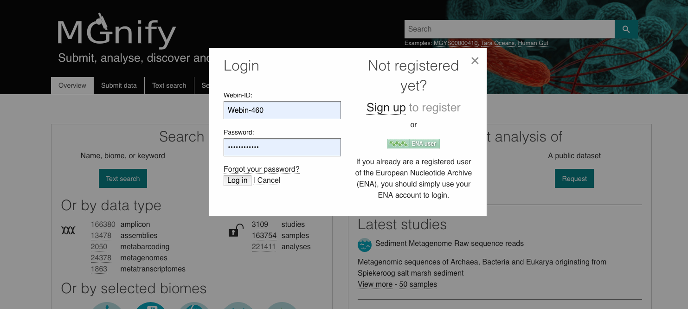

Website and portal
==================
------------------------------------------------------
Content of the 'Associated runs' table on project page 
------------------------------------------------------

This table lists all :term:`samples<sample>` and :term:`runs<run>` associated with a project as well as the experiment type (:term:`Amplicon<amplicon>`, :term:`Assembly<assembly>`, :term:`Metabarcoding<metabarcoding>`, :term:`Metagenomic<metagenomic>` or :term:`Metatranscriptomic<metatranscriptomic>`), sequencing instrument model and pipeline version for each individual run.
In addition, the last field displays links to analysis results and download pages (the latter being represented by the |icon| icon). 

The 'Analysis results' field could also displays two types of messages:

- 'QC not passed’: this message indicates that no sequences survived the filtering occurring during the QC steps. This could be due to base quality filtering, ambiguous base filtering or length filtering.
- ‘Unable to process’: this message indicates that no data suitable for analysis were available for this run. The sequences may not be available in ENA, failed to merge, in the case of pair-end reads, or be in an unsuitable format.

------------------------------------------------------------------------------
Finding quality control information about runs on the MGnify website
------------------------------------------------------------------------------

Quality control (QC) analysis of runs within projects on the `MGnify website <https://www.ebi.ac.uk/metagenomics/>`__ can be accessed by selecting the 'Quality control' tab found toward the top of any run page (see Figure 1 below).

.. image:: images/QC1.PNG

**Figure 1**. A 'Quality control' tab can be found towards the top of each run page.

Selecting this tab brings a page containing four graphical representations giving the number of reads remaining, and filtered, after each QC step as well as the length, GC content and nucleotide distributions of the reads having passed the QC referred as processed reads. These are available to download via the 'Download' tab found toward the top of any run page (see Figure 8 below).

An histogram is used to represent the nucleotide distribution for the first 500 nucleotides of the processed reads; while metagenome, metatranscriptome and assembly chart should indicate an even distribution (Figure 2 below), amplicon graph should indicate a clearly uneven pattern.

.. image:: images/QC_metag.PNG

**Figure 2**. Typical even nucleotide distribution expected for metagenome, metatranscriptome and assembly. Note that the stretch of uneven distribution observed until position 20 are indicative that the sequencing adapters had not been completely removed in the submitted reads.

.. image:: images/QC_ndamplicon.PNG

**Figure 3**. Typical uneven nucleotide distribution expected for amplicon. 

-------------------------------------------------------------------------
Finding functional information about runs on the MGnify website
-------------------------------------------------------------------------

Functional analysis of runs within projects on the `MGnify website <https://www.ebi.ac.uk/metagenomics/>`__ can be accessed by selecting the 'Functional Analysis' tab found toward the top of any run page (see Figure 4 below). Note that this tab will be greyed for amplicon runs that have no functional results.

.. image:: images/Func_1.PNG (this image needs changing! Once bar graphs are changed!)

**Figure 4**. A Functional analysis tab can be found towards the top of each run page. Selecting this tab brings up a page displaying sequence features ('Predicted CDS', 'Contigs with predicted CDS' and 'Contigs with predicted rRNA')

Below this first bar chart, there are 4 tabs with different types of functional annotation:

**A**

**B**

**C**

.. image:: images/Func3-v5.png

**D**

.. image:: images/Func4-v5.png

**Figure 5**. Functional analysis of metagenomics data, as shown on the MGnify website. A) InterPro match information for the predicted coding sequences in the run is shown. The number of InterPro matches are displayed graphically, and as a table that has a text search facility.  B) The GO terms predicted for the sample are displayed. Different graphical representations are available, and can be selected by clicking on the ‘Switch view’ icons. C) A table of Pfam matches for predicted coding sequences with a bar graph showing the top 10 Pfam hits. D) A table of KEGG ortholog matches for predicted coding sequences with a bar graph showing the top 10 KEGG ortholog hits.

The Gene Ontology terms displayed graphically on the web site have been 'slimmed' with a special :term:`Go slim` developed for metagenomic data sets. GO slims are cut-down versions of the Gene Ontology, containing a subset of the terms in the whole GO. They give a broad overview of the ontology content without the detail of the specific fine-grained terms.

The full data sets used to generate both the :term:`InterPro` and GO overview charts, along with a host of additional data and intermediate files (processed reads, pCDS, reads encoding RNA and taxonomic analysis  results) can be downloaded for further analysis by clicking the Download tab, found towards the top of the page (see complete description here: `Files available to download on the MGnify website`_)

-------------------------------------------------------------------------
Finding pathways/systems information about runs on the MGnify website
-------------------------------------------------------------------------

Pathway and systems annotation of runs within projects on the `MGnify website <https://www.ebi.ac.uk/metagenomics/>`__ can be accessed by selecting the 'Pathways/Systems' tab found toward the top of any run page. Note that this tab will only be accessible for assembly analysis.

There are 3 types of pathways and systems annotations:

**A**

.. image:: images/Path1-v5.png

**B**

.. image:: images/Path2-v5.png

**C**

**Figure 6**. Annotation of potential pathways and high order system classification, as shown on the MGnify website. A) A table and bar graph of KEGG modules derived from KEGG orthologs, with pathway completeness values. B) An expandable list of present Genome Properties derived from InterProScan outputs. C) A table of antiSMASH hits with a bar graph showing the top 10 hits.

------------------------------------------------------------------------
Viewing functional annotation per contig
------------------------------------------------------------------------

This feature is available for assembly analysis only and can be found in the tab 'Contig Viewer'.

**A**

.. image:: images/Contig1-v5.png

**B**

**Figure 8**. Interactive contig viewer for an in depth functional annotation per contig. A) Main page contains table of contigs with annotations, length and coverage. Text search bars and tickboxes allow users to search for particular functional annotations. B) Hover over each coding sequence to see functional annotation with external links, and protein length for that region.

------------------------------------------------------------------------
Finding taxonomic information about runs on the MGnify website
------------------------------------------------------------------------

Taxonomic analysis of runs within projects on the `MGnify website <https://www.ebi.ac.uk/metagenomics/>`__ can be accessed by selecting the 'Taxonomic analysis' tab found toward the top of any run page (see Figure 7 below).

.. image:: images/taxonomy.PNG

**Figure 7**. A 'Taxonomic analysis' tab can be found towards the top of each run page. Selecting this tab brings up a page displaying the taxonomic results displayed as a interactive `_Krona plot <https://github.com/marbl/Krona/wiki>`__.

The taxonomic analysis results are displayed as Krona plot. This feature allows users to explore their taxonomic results and to zoom in on a particular taxonomic level by double clicking on it. The corresponding distribution charts are displayed on the right hand side of the panel.

Alternative pie, bar and stacked chart representations can be generated by clicking on the ‘Switch view’ icons located above the Krona plot however data are then presented at the phylum level for clarity.

The full data sets used to generate both Krona and other charts, along with a host of additional data and intermediate files (processed reads, pCDS, reads encoding RNA and functional analysis results) can be downloaded for further analysis by clicking the Download tab, found towards the top of the page (see complete description here: `Files available to download on the MGnify website`_)

-----------------------------------------------------------
Files available to download on the MGnify website
-----------------------------------------------------------

MGnify analysis pipeline produces a number of files underlying the charts displayed on the website. These files are available via the 'Download' tab found toward the top of any run page (see Figure 8 below).

**Figure 8**. The Download tab is organised in 3 sections: ‘Sequence data’, ‘Functional analysis’ (not available in the case of amplicon runs), 'Pathways and Systems' (available only for assemblies), ‘Taxonomic analysis SSU’, 'Taxonomic analysis LSU', 'Taxonomic analysis ITS' (available for amplicon only) and 'non-coding RNAs' (will only exist if any non coding RNAs are identified).

Some of the files, particularly the sequence files in FASTA format, can be large. To facilitate their download process, these files are compressed with `GZIP <https://en.wikipedia.org/wiki/Gzip>`_ and when too large to be easily transferable, chunked in manageable size. If it is the case for your runs, please download all chunks, decompress them and concatenate them to reconstitute the full files. Please ensure the chunks are concatenated in the correct order as headers will be in the first chunked file.

Description of fasta files available to download
^^^^^^^^^^^^^^^^^^^^^^^^^^^^^^^^^^^^^^^^^^^^^^^^
- Processed nucleotide reads OR Processed contigs: this file contains all reads/contigs having passed the quality control (QC) step.
- Predicted CDS: this file contains protein sequences having predicted CDS(s) (pCDS). The CDS prediction is performed using `FragGenScan <http://omics.informatics.indiana.edu/FragGeneScan>`_ and Prodigal on the reads having passed the QC after masking of predicted rRNA and tRNA.
- Predicted ORF: this file contains nucleotide sequences having pCDS.

Description of functional annotation files available to download
^^^^^^^^^^^^^^^^^^^^^^^^^^^^^^^^^^^^^^^^^^^^^^^^^^^^^^^^^^^^^^^^
- InterPro matches: A tab-delimited file containing 15 columns. They are fully described `here <https://github.com/ebi-pf-team/interproscan/wiki/OutputFormats>`_
- Pfam annotation: summary of Pfam annotations and their frequencies.
- Complete GO annotation file: it is a comma-separated file containing 4 columns. The first column lists the GO terms (labelled GO:XXXXXXX) having been associated with the predicted CDSs. The second gives the GO term description while the third indicates which category the GO term belong to. There is 3 category: ‘biological process’ (higher biological process such as ‘rRNA modification’) , ‘molecular function’ (individual catalytic activity such as ‘mannosyltransferase activity’) and ‘cellular component’ (cellular localisation of the activity such as ‘mitochondrion’). The last column give the number of predicted CDSs having been annotated with the GO terms for the run.
- GO slim annotation file: this file is derived from the 'Complete GO annotation file' and has the same format. The GO slim set is a cut-down version of the GO terms containing a subset of the terms in the whole GO. They give a broad overview of the ontology content without the details of the specific fine grained terms. Go slim terms are used for visualisation on the website. To illustrate how the GO slim terms relates to the GO terms, the different metal binding GO terms present in the ‘Complete GO annotation’ file are summarized as one generic metal binding term in the ‘GO slim annotation’ file. The last column give the number of predicted CDSs having been annotated with the GO slim terms for the run.
- Diamond annotation: a tab-delimited file containing 16 columns. The columns show taxonomic annotation of protein sequences.
- KEGG orthologues annotation: summary of KEGG ortholog annotations and their frequencies.

Description of taxonomic assignment files available to download
^^^^^^^^^^^^^^^^^^^^^^^^^^^^^^^^^^^^^^^^^^^^^^^^^^^^^^^^^^^^^^^^

- Reads encoding...: these file contains all reads predicted to encode for LSU, SSU, ITS or any other non-coding RNAs (ncRNAs). LSU, SSU and ncRNAS are predicted with Infernal. ITS have LSU and SSU sequences masked.
- MAPseq assignments: this file contains the output from mapseq - a taxonomic assignment for each input sequence.
- NEED TO ADD THIS TO DOWNLOAD SECTION!!! - Taxonomic assignments (TSV): this file contains one ‘Taxonomy’ column followed by the frequency of it's annotation. This file can be directly imported into `Megan6 <http://ab.inf.uni-tuebingen.de/software/megan6/>`_ for visualisation and further analysis.
- OTUs, counts and taxonomic assignments - two files for each type of rRNA or ITS database. These contain the same taxonomic information as the TSV files in JSON and HDF5 formats. The Biom files are `computer-readable files <http://biom-format.org>`_. The HDF5 (Hierachical Data Format) format can be imported into analysis and visualisation tools such as Matlab and R. A larger number of commercial and freely available tools, such as MEGAN6, can consume the JavaScript Object Notation (JSON) format.

-------------
Summary files
-------------
In addition to the output files for individual runs, described above, MGnify provides a number of summary files available via the 'Analysis summary' tab on the project page (Figure 9 below). They summarized the counts per feature across all runs of a :term:`study` and therefore provide an easy way to identify patterns. The summary files are split between functional (not available for amplicon-only study) and taxonomy sections.

.. image:: images/summary.PNG

**Figure 9**. The 'Analysis summary' tab is organised in 2 sections: ‘Functional analysis for the project’ and ‘Taxonomic analysis for the project’ (the former is not available in the case of amplicon runs).

-----------------------------------------
Data discovery on MGnify portal
-----------------------------------------

MGnify is the largest metagenomic resource of public datasets. In order to help users accessing the data present on the portal, MGnify offers a powerful search tool and a range of browsing options.

Search tool
^^^^^^^^^^^
The Search tool is underpinned by `EBI search <https://www.ebi.ac.uk/ebisearch/overview.ebi>`_  and accessible via any MGnify page (Figure 11 below). 

**Figure 11**. The 'Search tool' can be accessed using the 'search' tab or the 'search' button located on the right of the MGnify banner. The search space can be restricted using the 'search' field located above the latter.

The search page contains 3 tabs allowing users to navigate between project, sample and run search levels. In each tab, the left hand side panel provide a number of facets that can be used to restrict the search space.

- at the project level, the search can be restricted by 'biome' and 'centre name'. Selection of any of the facets will impact the search at sample and run level in order to be able to drill down into the results. Search results can be downloaded as tab-separated file.
- at the sample level, in addition to 'biome', the choice of facets includes 'temperature', 'depth', 'sequencing method', 'sample origination', 'disease status' and 'phenotype', when provided. Note that these metadata are provided by the data submitter and are not curated.
- at the run level, users can restrict their searches according to 'biome', 'temperature', 'depth', 'pipeline version', 'organism', 'experiment type' as well as Go and InterPro terms.

Browsing options
^^^^^^^^^^^^^^^^

- Public project can be accessed using the links corresponding to the number of projects, samples and runs or experiment types located on the MGnify home page below the main banner. Selecting one of those will redirect users to the corresponding MGnify search page.
- Another way to discover data of interest is to browse the public projects by biome as displayed on the MGnify homepage. The 10 biomes with higher number of projects are displayed by default however the list can be extended using the 'See all biomes' link.  Upon selection, a table giving the hierarchical lineage according to `GOLD database classification <https://gold.jgi.doe.gov/distribution#Classification>`_  is provided. On the right hand-side of this table, the number of projects associated to the lineage in the strict sense or including sub-lineages are displayed as dynamic links giving access to the selected projects.
- Users can also access particular projects, or samples, using the corresponding tabs located above the MGnify banner. The list of projects, or samples, can be restricted using the Biome drop-down menu and/or text search. The results of this filtering can be downloaded using the two spreadsheet icons located above the right hand-side of the tables.
- Finally, users have the option to access, from the MGnify homepage, the latest public projects uploaded via the right side of the 'Browse projects' section.

-----------------------------------------
Private area
-----------------------------------------

If you have given consent to the MGnify team to analyse your data for which you have requested a pre-publication confidential hold, you can access the analysis results of those pre-published data sets by using your private area. You can simply access this area by clicking on the 'Login' button, which you will find on the top right hand side of any page (see Figure 12 below).

**Figure 12**. A login dialog will open once you have clicked on the 'Login' button, which can be found on the right top corner of each page.

After you have successfully logged into our system, you will have direct access to all your privately (and publicly) submitted projects and samples. You will find a list of your latest submissions (projects and samples) on the home page, but you have also access to all your submitted projects so far on the projects list view (Figure 13 below). On that page you will find a drop down filter item 'My projects', which allows you to list all your projects.

.. image:: images/my_projects_cu.png

**Figure 13**. Filter options on the projects list view. 

