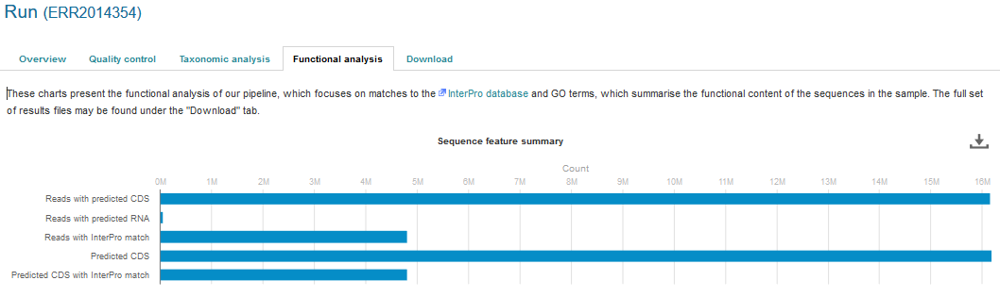
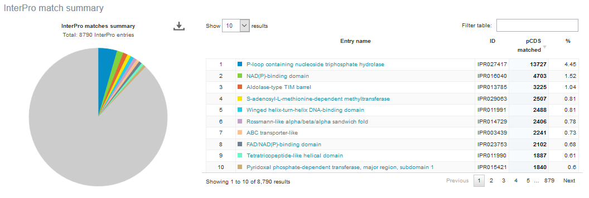
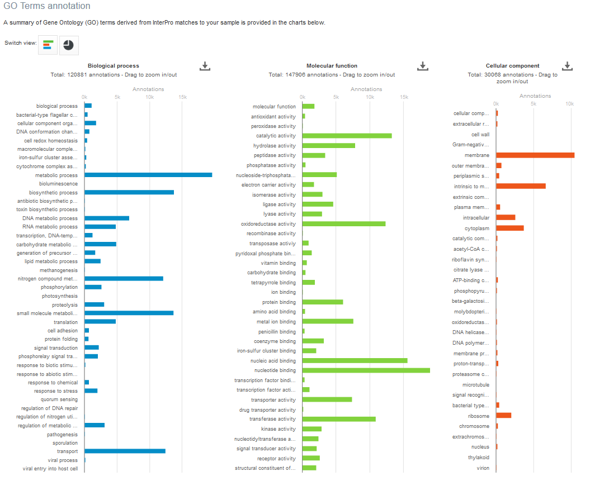
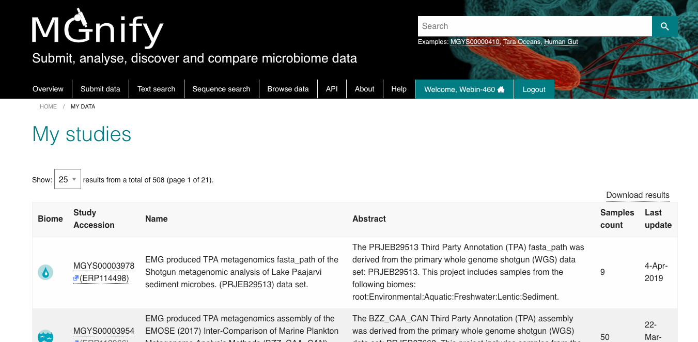

Website and portal
==================
------------------------------------------------------
Content of the 'Associated runs' table on project page 
------------------------------------------------------

This table lists all :term:`samples<sample>` and :term:`runs<run>` associated with a project as well as the experiment type (:term:`Amplicon<amplicon>`, :term:`Assembly<assembly>`, :term:`Metabarcoding<metabarcoding>`, :term:`Metagenomic<metagenomic>` or :term:`Metatranscriptomic<metatranscriptomic>`), sequencing instrument model and pipeline version for each individual run.
In addition, the last field displays links to analysis results and download pages (the latter being represented by the |icon| icon). 

.. |icon| image:: images/download_IC.png

The 'Analysis results' field could also displays two types of messages:

- 'QC not passed’: this message indicates that no sequences survived the filtering occurring during the QC steps. This could be due to base quality filtering, ambiguous base filtering or length filtering.
- ‘Unable to process’: this message indicates that no data suitable for analysis were available for this run. The sequences may not be available in ENA, failed to merge, in the case of pair-end reads, or be in an unsuitable format.

------------------------------------------------------------------------------
Finding quality control information about runs on the EBI Metagenomics website
------------------------------------------------------------------------------

Quality control (QC) analysis of runs within projects on the `EBI Metagenomics website <https://www.ebi.ac.uk/metagenomics/>`__ can be accessed by selecting the 'Quality control' tab found toward the top of any run page (see Figure 1 below).

.. image:: images/QC1.PNG

**Figure 1**. A 'Quality control' tab can be found towards the top of each run page.

Selecting this tab brings a page containing four graphical representations giving the number of reads remaining, and filtered, after each QC step as well as the length, GC content and nucleotide distributions of the reads having passed the QC referred as processed reads. These are available to download via the 'Download' tab found toward the top of any run page (see Figure 8 below).

An histogram is used to represent the nucleotide distribution for the first 500 nucleotides of the processed reads; while metagenome, metatranscriptome and assembly chart should indicate an even distribution (Figure 2 below), amplicon graph should indicate a clearly uneven pattern.

.. image:: images/QC_metag.PNG

**Figure 2**. Typical even nucleotide distribution expected for metagenome, metatranscriptome and assembly. Note that the stretch of uneven distribution observed until position 20 are indicative that the sequencing adapters had not been completely removed in the submitted reads.

**Figure 3**. Typical uneven nucleotide distribution expected for amplicon. 

-------------------------------------------------------------------------
Finding functional information about runs on the EBI Metagenomics website
-------------------------------------------------------------------------

Functional analysis of runs within projects on the `EBI Metagenomics website <https://www.ebi.ac.uk/metagenomics/>`__ can be accessed by selecting the 'Functional Analysis' tab found toward the top of any run page (see Figure 4 below). Note that this tab will be greyed for amplicon runs that have no functional results.

**Figure 4**. A Functional analysis tab can be found towards the top of each run page. Selecting this tab brings up a page displaying sequence features ('number of reads with predicted CDS (pCDS)', 'number of reads with predicted RNA', 'number of reads with InterPro matches', 'number of pCDS' and 'number of pCDS with InterPro match').

Below this first bar chart, two other charts display the InterPro match information and GO term annotation for the run, as shown in Figure 5A and 5B below.

**A**

**B**

**Figure 5**. Functional analysis of metagenomics data, as shown on the EBI Metagenomics website. A) InterPro match information for the predicted coding sequences in the run is shown. The number of InterPro matches are displayed graphically, and as a table that has a text search facility.  B) The GO terms predicted for the sample are displayed. Different graphical representations are available, and can be selected by clicking on the ‘Switch view’ icons.

The Gene Ontology terms displayed graphically on the web site have been 'slimmed' with a special :term:`Go slim` developed for metagenomic data sets. GO slims are cut-down versions of the Gene Ontology, containing a subset of the terms in the whole GO. They give a broad overview of the ontology content without the detail of the specific fine-grained terms.
 
The full data sets used to generate both the :term:`InterPro` and GO overview charts, along with a host of additional data and intermediate files (processed reads, pCDS, reads encoding RNA and taxonomic analysis  results) can be downloaded for further analysis by clicking the Download tab, found towards the top of the page (see complete description here: `Files available to download on the EBI Metagenomics website`_)

------------------------------------------------------------------------
Finding taxonomic information about runs on the EBI Metagenomics website
------------------------------------------------------------------------

Taxonomic analysis of runs within projects on the `EBI Metagenomics website <https://www.ebi.ac.uk/metagenomics/>`__ can be accessed by selecting the 'Taxonomic analysis' tab found toward the top of any run page (see Figure 7 below).

.. image:: images/taxonomy.PNG

**Figure 7**. A 'Taxonomic analysis' tab can be found towards the top of each run page. Selecting this tab brings up a page displaying the taxonomic results displayed as a interactive `_Krona plot <https://github.com/marbl/Krona/wiki>`__. 

The taxonomic analysis results are displayed as Krona plot. This feature allows users to explore their taxonomic results and to zoom in on a particular taxonomic level by double clicking on it. The corresponding distribution charts are displayed on the right hand side of the panel.

Alternative pie, bar and stacked chart representations can be generated by clicking on the ‘Switch view’ icons located above the Krona plot however data are then presented at the phylum level for clarity.

The full data sets used to generate both Krona and other charts, along with a host of additional data and intermediate files (processed reads, pCDS, reads encoding RNA and functional analysis results) can be downloaded for further analysis by clicking the Download tab, found towards the top of the page (see complete description here: `Files available to download on the EBI Metagenomics website`_)

-----------------------------------------------------------
Files available to download on the EBI Metagenomics website
-----------------------------------------------------------

EBI Metagenomics analysis pipeline produces a number of files underlying the charts displayed on the website. These files are available via the 'Download' tab found toward the top of any run page (see Figure 8 below).

.. image:: images/Download_1.png

**Figure 8**. The Download tab is organised in 3 sections: ‘Sequence data’, ‘Functional analysis’ (not available in the case of amplicon runs)  and ‘Taxonomic analysis’.

Some of the files, particularly the sequence files in FASTA format, can be large. To facilitate their download process, these files are compressed with `GZIP <https://en.wikipedia.org/wiki/Gzip>`_ and when too large to be easily transferable, chunked in manageable size. If it is the case for your runs, please download all chunks, decompress them and concatenate them to reconstitute the full files.

Description of fasta files available to download
^^^^^^^^^^^^^^^^^^^^^^^^^^^^^^^^^^^^^^^^^^^^^^^^
- Processed nucleotide reads: this file contains all reads having passed the quality control (QC) step.
- Processed reads with pCDS: this file contains all processed reads having having predicted CDS(s) (pCDS). The CDS prediction is performed using `FragGenScan <http://omics.informatics.indiana.edu/FragGeneScan>`_ on the reads having passed the QC after masking of predicted rRNA and tRNA.
- Processed reads with annotation: this file contains all processed reads containing pCDS(s) annotated by `InterProScan <https://www.ebi.ac.uk/interpro/interproscan.html>`_.
- Processed reads without annotation: this file contains all processed reads having pCDS(s) not annotated by InterProScan
- Predicted CDS with annotation : this file contains all the predicted proteins having been annotated by InterProScan. The sequence headers are: <run_id>_<start of pCDS>_<end of pCDS>_<strand of pCDS><space><InterPro term>/<member database ID>/<start of hit in predicted protein>-<end of hit in predicted protein>.
- Predicted CDS without annotation: this file contains all the predicted proteins not annotated by InterProScan. The sequence headers are <run_id>_<start of pCDS>_<end of pCDS>_<strand of pCDS>.
- Predicted ORF without annotation: this file contains all the pCDS coding for predicted proteins that were not annotated by InterProScan. The sequence headers are <run_id>_<start of pCDS>_<end of pCDS>_<strand of pCDS>.
- Predicted tRNAs: this file contains all the sequences predicted to encode tRNAs. The prediction was done using models from `Rfam <http://rfam.xfam.org>`_ with `HMMER tools <http://hmmer.org>`_.
- Reads encoding 5S rRNA: this file contains all reads predicted to encode for 5S rRNA by rRNASelector.
- Reads encoding 16S rRNA: this file contains all reads predicted to encode for 16S rRNA by rRNASelector.
- Reads encoding 23S rRNA: this file contains all reads predicted to encode for 23S rRNA by rRNASelector.

Description of functional annotation files available to download
^^^^^^^^^^^^^^^^^^^^^^^^^^^^^^^^^^^^^^^^^^^^^^^^^^^^^^^^^^^^^^^^
- InterPro matches file:  it is a tab-delimited file containing 15 columns. They are fully described `here <https://github.com/ebi-pf-team/interproscan/wiki/OutputFormats>`_
- Complete GO annotation file: it is a comma-separated file containing 4 columns. The first column lists the GO terms (labelled GO:XXXXXXX) having been associated with the predicted CDSs. The second gives the GO term description while the third indicates which category the GO term belong to. There is 3 category: ‘biological process’ (higher biological process such as ‘rRNA modification’) , ‘molecular function’ (individual catalytic activity such as ‘mannosyltransferase activity’) and ‘cellular component’ (cellular localisation of the activity such as ‘mitochondrion’). The last column give the number of predicted CDSs having been annotated with the GO terms for the run.
- GO slim annotation file: this file is derived from the 'Complete GO annotation file' and has the same format. The GO slim set is a cut-down version of the GO terms containing a subset of the terms in the whole GO. They give a broad overview of the ontology content without the details of the specific fine grained terms. Go slim terms are used for visualisation on the website. To illustrate how the GO slim terms relates to the GO terms, the different metal binding GO terms present in the ‘Complete GO annotation’ file are summarized as one generic metal binding term in the ‘GO slim annotation’ file. The last column give the number of predicted CDSs having been annotated with the GO slim terms for the run.

Description of taxonomic assignment files available to download
^^^^^^^^^^^^^^^^^^^^^^^^^^^^^^^^^^^^^^^^^^^^^^^^^^^^^^^^^^^^^^^^
- :term:`OTUs<OTU>`, reads and taxonomic assignments files: these  files contain the same data presented in 3 different format : tab-separated file (TSV) and two Biom file (HDF5 and JSON). The TSV file contains 3 columns which headers are in the second line of the file. The first column is the OTU Id. The second column indicates the number of predicted 16S sequences associated with each OTU. The third column contains the taxonomic lineages provided by `GreenGenes database <http://greengenes.lbl.gov/Download/>`_. Note that the number of unannotated 16S sequences is not indicated in this file. This file can be directly imported into `Megan6 <http://ab.inf.uni-tuebingen.de/software/megan6/>`_ for visualisation and further analysis. The OTU id can be compared between runs for version 2 and 3 of the pipeline as they have been generated using `Qiime closed-reference protocol <http://qiime.org/tutorials/otu_picking.html>`_.The Biom files are `computer-readable files <http://biom-format.org>`_. The HDF5 (Hierachical Data Format) format can be imported into analysis and visualisation tools such as Matlab and R. A larger number of commercial and freely available tools, such as MEGAN6, can consume the JavaScript Object Notation (JSON) format.
- Phylogenetic tree (Newick format)’ file (only available up to version 3 of EBI Metagenomics pipeline): this file can be used to visualise the hierarchical distribution of the taxonomic lineages of each run. The `Newick format <https://en.wikipedia.org/wiki/Newick_format>`_ is a computer-readable format to represent the tree and can be directly imported into freely-available viewers such as `FigTree <http://tree.bio.ed.ac.uk/software/figtree>`_ and `ITOL (interactive Tree of Life) <http://itol.embl.de>`_.

-------------
Summary files
-------------
In addition to the output files for individual runs, described above, EBI Metagenomics provides a number of summary files available via the 'Analysis summary' tab on the project page (Figure 9 below). They summarized the counts per feature across all runs of a :term:`study` and therefore provide an easy way to identify patterns. The summary files are split between functional (not available for amplicon-only study) and taxonomy sections.

.. image:: images/summary.PNG

**Figure 9**. The 'Analysis summary' tab is organised in 2 sections: ‘Functional analysis for the project’ and ‘Taxonomic analysis for the project’ (the former is not available in the case of amplicon runs).

functional summary files
^^^^^^^^^^^^^^^^^^^^^^^^
- InterPro matches(TSV): this tab-separated file contains 2 designation columns followed by a column for each valid runs of the project. The first column lists the InterPro terms having been associated to the predicted CDSs. The second column gives the description of the InterPro terms. All columns labelled with a run identifier present the number of predicted CDSs having been annotated with each InterPro terms for this run.
- Complete GO annotation (TSV): this file contains 3 designation columns followed by a column for each valid runs of the project. The first column lists the GO terms (labelled GO:XXXXXXX) having been associated to the predicted CDSs. The second column gives the GO term description while the third column indicates which category the GO term belong to. All columns labelled with a run identifier present the number of predicted CDSs having been annotated with each GO terms for this run.
- The ‘GO slim annotation (TSV)’ file is derived from the ‘Complete GO annotation’ file and has the same format. The GO slim term set is a cut-down version of the GO terms containing a subset of the terms in the whole GO. They give a broad overview of the ontology content without the detail of the specific fine grained terms. 

taxonomy summary files
^^^^^^^^^^^^^^^^^^^^^^
- Taxonomic assignments (TSV): this file contains one ‘Taxonomy’ column followed by a column for each valid runs of the project. The ‘Taxonomy’ column list the taxonomic lineages having been associated with the predicted 16S sequences. All columns labelled with a run identifier present the number of predicted 16S sequences having been annotated with the taxonomic lineages for this run. This file can be directly imported into `Megan6 <http://ab.inf.uni-tuebingen.de/software/megan6/>`_ for visualisation and further analysis.
- The ‘Phylum level taxonomies (TSV)’ file is derived from the ‘Taxonomic assignments’ file and presents the assignments brought up to ‘phylum’ level in order to give a high level view of the taxonomic assignments. The two first columns of this file present the ‘kingdom’ and ‘phylum’ level assignments, respectively. All columns labelled with a run identifier present the number of predicted 16S sequences having been annotated with the ‘phylum’ level taxonomic lineages for this run.

---------------
Comparison tool
---------------
Comparing runs helps to identify feature associated with experimental factors. EBI Metagenomics has developed a Comparison Tool that allows user to compare the GO-slim terms associated with the runs of a project (see `Analysis pipeline <http://emg-docs.readthedocs.io/en/latest/analysis.html>`__).

**To use the current tool, select the corresponding tab from any EBI Metagenomics webpage (Figure 10 below):**

.. image:: images/comp.PNG

**Figure 10**. The 'Comparison tool' tab let the user select projects and associated runs to compare them based on the GO-slim distribution.

- The first step is to select the project of interest. They are listed by title in alphabetical order. You can search the project list by entering the first letters of the title from the project you’re interested in.
- Clicking on the ‘More info about selected project’ link, located below the Project list, after selecting a project, will open a new browser window displaying the project page.
- Upon project selection, the 'Run list' window will be populated with the list of runs associated with the project and suitable for comparison. You can select all runs (using the ‘Select all’ link below the window) or up to 30 runs (by using the Ctrl key for Windows PC or Command key on Mac).
- Users can select the ‘Advanced settings’ link to have the options to set the relative abundance threshold for the GO terms to appear in the stack columns, the format of heatmap generated and the number of GO terms with most variation to display in the representations.   

**To start the comparison for your selection, simply click on ‘Compare’.** 
The page will now display the study and selected runs on top of 5 new comparison tabs:  

- The first one is a barcharts representation with 3 dynamic graphs, corresponding to the 3 GO terms categories (see :ref:`Analysis pipeline <analysis>`). On each, the GO terms and their relative abundance in each selected run is displayed. Hovering the mouse pointer above a bar will display the relative abundance values for this term in the corresponding run. You can export these barcharts representation in PNF, PDF or SVG format using the tool on the top right hand side.
- The second tab contains stacked column representations with the same dynamic properties than in the barcharts with the addition of the possibility to hide one or more terms of choice by selecting them from the list displayed below each category graph.  
- The third tab presents heatmaps allowing to quickly identified patterns between the selected runs based on the relative abundance of the GO terms. There is currently no export function for this page although the images, being static, can be directly copied.  
- The fourth tab contains dynamic Principal Component Analysis graphs which represent the amount of variance between runs, based on the relative abundance of the GO terms, between the runs for each GO category. Selecting a rectangular region with the mouse pointer will zoom in, which help to separate clustered run markers. The export function allows to download all or the enlarged region.  
- The last tab is a searchable table where you can see the absolute and relative abundance of a given GO term for each run. It is based on the ‘Analysis_summary’ abundance table available from the project page. You can search the table using the run identifier, GO name, GO category, GO id or even absolute or relative abundance.  

We are working with collaborators to develop this tool in order to be able to compare taxonomic annotations, provide statistical validations and compare runs between projects.

-----------------------------------------
Data discovery on EBI Metagenomics portal
-----------------------------------------

EBI metagenomics is the largest metagenomic resource of public datasets. In order to help users accessing the data present on the portal, EBI Metagenomics offers a powerful search tool and a range of browsing options.

Search tool
^^^^^^^^^^^
The Search tool is underpinned by `EBI search <https://www.ebi.ac.uk/ebisearch/overview.ebi>`_  and accessible via any EBI Metagenomics page (Figure 11 below). 

.. image:: images/search.PNG

**Figure 11**. The 'Search tool' can be accessed using the 'search' tab or the 'search' button located on the right of the EBI Metagenomics banner. The search space can be restricted using the 'search' field located above the latter.

The search page contains 3 tabs allowing users to navigate between project, sample and run search levels. In each tab, the left hand side panel provide a number of facets that can be used to restrict the search space.

- at the project level, the search can be restricted by 'biome' and 'centre name'. Selection of any of the facets will impact the search at sample and run level in order to be able to drill down into the results. Search results can be downloaded as tab-separated file.
- at the sample level, in addition to 'biome', the choice of facets includes 'temperature', 'depth', 'sequencing method', 'sample origination', 'disease status' and 'phenotype', when provided. Note that these metadata are provided by the data submitter and are not curated.
- at the run level, users can restrict their searches according to 'biome', 'temperature', 'depth', 'pipeline version', 'organism', 'experiment type' as well as Go and InterPro terms.

Browsing options
^^^^^^^^^^^^^^^^

- Public project can be accessed using the links corresponding to the number of projects, samples and runs or experiment types located on the EBI Metagenomics home page below the main banner. Selecting one of those will redirect users to the corresponding EBI Metagenomics search page.
- Another way to discover data of interest is to browse the public projects by biome as displayed on the EBI Metagenomics homepage. The 10 biomes with higher number of projects are displayed by default however the list can be extended using the 'See all biomes' link.  Upon selection, a table giving the hierarchical lineage according to `GOLD database classification <https://gold.jgi.doe.gov/distribution#Classification>`_  is provided. On the right hand-side of this table, the number of projects associated to the lineage in the strict sense or including sub-lineages are displayed as dynamic links giving access to the selected projects.
- Users can also access particular projects, or samples, using the corresponding tabs located above the EBI Metagenomics banner. The list of projects, or samples, can be restricted using the Biome drop-down menu and/or text search. The results of this filtering can be downloaded using the two spreadsheet icons located above the right hand-side of the tables.
- Finally, users have the option to access, from the EBI Metagenomics homepage, the latest public projects uploaded via the right side of the 'Browse projects' section.

-----------------------------------------
Privat area
-----------------------------------------

If you have given consent to the EBI Metagenomics team to analyse your data for which you have requested a pre-publication confidential hold, you can access the analysis results of those pre-published data sets by using your private area. You can simply access this area by clicking on the 'Login' button, which you will find on the top right hand side of any page (see Figure 12 below).

.. image:: images/how_to_login.png

**Figure 12**. A login dialog will open onces you have clicked on the 'Login' button, which can be found on the right top corner of each page.

After you have successfully logged into our system, you will have direct access to all your privately (and publicly) submitted projects and samples. You will find a list of your latest submissions (projects and samples) on the home page, but you have also access to all your submitted projects so far on the projects list view (Figure 13 below). On that page you will find a drop down filter item 'My projects', which allows you to list all your projects.

**Figure 13**. Filter options on the projects list view. 

The comparison tool will list all your non-amplicon projects in the private area, for you ready to compare.  Currently we do not permit the comparison of public and private data. In the public area you will find a list of all publicly available projects in EMG.
