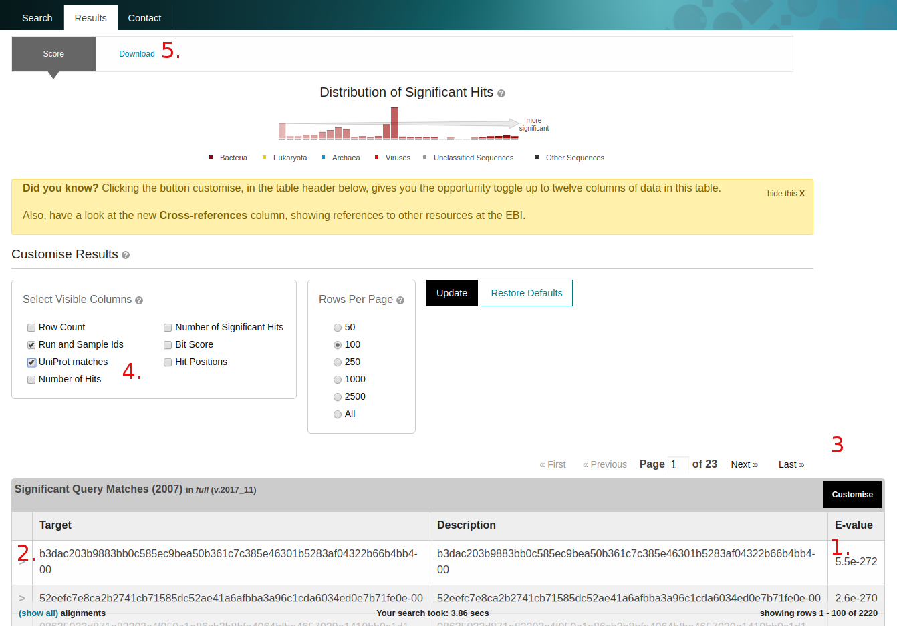

Sequence search
^^^^^^^^^^^^^^^

------------
Landing page
------------

The sequence search (accessed by following the 'Sequence search' link from menu bar)
provides a search against a catalogue of predicted peptides.

**Figure 1**. The landing page of the sequence search tool

These sequences comprise a non-redundant set of proteins predicted from contigs that
have been assembled from sequencing runs. The HMMER search
engine has been adapted to provide fast searches against this database.
The results can be linked back to the sample and run from which the peptide was derived
and also to sequences with an exact match in the UniProt database.

The search takes a FASTA-formatted amino acid sequence.

**Figure 2**. Example of a well-formatted input sequence

You can search against all of the sequences in the database ('All'),
or restrict your search to full length sequences partial
sequences only (see ref:`Partial and full length peptides`).

**Figure 3**. How to select the peptide database to search against?

-----------
Result page
-----------

On completion a list of matching sequences is shown in order of E-value significance (1.).
Since identical peptides could be derived
from different samples and runs, we use a unique hash sum (SHA256) as
the sequence identifier (2.). The mapping to UniProt identifiers and EBI
Metagenomics run/sample accessions can be switched on by selecting
'Customize' (3.) on the results page and checking the appropriate
boxes (4.).

**Figure 4**. Different features on the result page after triggering a sequence search

At this time, it is not possible to link directly to the
matching sequence from the results table. However, in the download
tab (5.), the 'Full length FASTA’ link will provide all the matching
sequences. Alternatively, the sequences are available on our `FTP server <ftp://ftp.ebi.ac.uk/pub/databases/metagenomics/peptide_database>`_.

-------------
Build process
-------------

The database is updated periodically and is created as follows:

* Short reads from runs are assembled into contigs using metaSPAdes, Minia or MEGAHIT
* Contigs are filtered by length (minimum 500 base pairs)
* Peptides are predicted using a combined gene caller (Prodigal and FragGeneScan)
* Resulting peptides are made non-redundant to produce a set of unique sequences
* Sequences are mapped back to EBI Metagenomics run and sample accessions
* Sequences are compared to UniProt and accessions for matching sequences are mapped
* Domain architectures are identified using the Pfam database

Each update (versioned using the release year/month) is cumulative and
uses all predicted peptides available at that time.

--------------------------------
Partial and full length peptides
--------------------------------

In common with some other protein coding sequence predictors, `Prodigal <https://github.com/hyattpd/prodigal/wiki/introduction>`_ provides an indication
as to whether a gene is full length or extends beyond the contig. To
indicate this, the sequence ID has two digits appended (one for each end of
the sequence), each of which is either 0 (the gene is
encoded within the contig) or 1 (it extends beyond). Thus a full length
sequence is suffixed with '-00' and a partial with '-11'. The
notation '-10' or '-01' is used for the cases where the gene
is truncated at only one end. Based on this information, three peptide
sequence sets are available for searching: peptides derived from full
length genes, peptides derived from partial genes, and all peptides.

.. highlight:: bash

Example::
>seq_1 # 3 # 371 # 1 # ID=1_1;partial=10;start_type=Edge;rbs_motif=None;rbs_spacer=None;gc_cont=0.501
SEGCEYLAAYLDKRIASGETINESSAVMTLSQGYLMKGRNKDAGKKFITTPAITKEIREA
QT
>seq_2 # 4738 # 5193 # -1 # ID=1_9;partial=00;start_type=ATG;rbs_motif=None;rbs_spacer=None;gc_cont=0.568
MSAYWYAVIWGGSFGAVLAAAGPRFRKAIPAIRGRMKNSIKWSTSAKAINGISWAGPFAA
QT
>seq_3 # 7546 # 8232 # -1 # ID=1_11;partial=00;start_type=TTG;rbs_motif=GGAG/GAGG;rbs_spacer=5-10bp;gc_cont=0.541
MKKKVLSIQNIACETLGTLEGMFRKDGLEVENVSAQEGGIPIKSSEYSAVVVLGGPMAVY
QT
>seq_4 # 32 # 103 # -1 # ID=37115_1;partial=01;start_type=Edge;rbs_motif=None;rbs_spacer=None;gc_cont=0.542
WILDGIDIDAMIRHPVRQYQIAG

------------
Availability
------------

As well as searches via a web server, we
provide all data for download from our FTP server. This includes
the sequence database, run, sample, SwissProt and Trembl mappings,
Pfam architectures, and counts of the number of times each sequences
was observed in the database as a whole.

**Figure 5**. Different features on the result page after triggering a sequence search

-------------------
Further information
-------------------

`Full documentation <https://hmmer-web-docs.readthedocs.io/en/latest/>`_
regarding the HMMER webserver is available. Note that some of the documented
features (such as the taxonomy view) are not relevant to the peptide search
and are therefore disabled.
Other features (such as the jackhmmer iterative search and batch search)
will be added at a later date.
